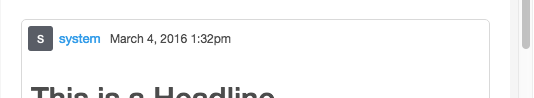
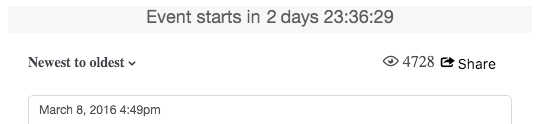
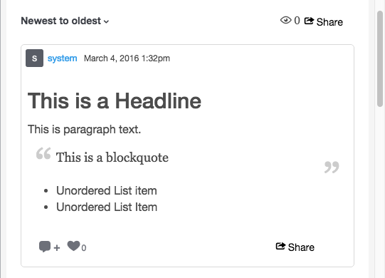
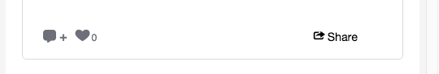

# Storify CSS Classes{#storify-css-classes}

Classes CSS disponibles pour vos applications Storify.

Utilisez CSS pour personnaliser vos applications Storify pour une intégration plus complète à votre page, en remplaçant simplement la page CSS par défaut par votre propre feuille de style. Cette section décrit les personnalisations CSS disponibles.

## Eléments d’auteur {#section_tdy_hsh_xz}

Permet de personnaliser la mise en forme de l’avatar de l’auteur de la publication, du nom de l’auteur et de l’horodatage.

| Classe | Description |
|---|---|
| .s-nom-auteur | Auteur |
| .s-author-avatar | L’avatar de l’auteur. |
| .s-img | L’avatar de l’auteur. |
| .s-timestamp | Horodatage pour la date de publication du contenu. |

## Éléments d’en-tête {#section_nbv_gsh_xz}

Permet de personnaliser la section d’en-tête de la page d’article.

| **Classe** | **Description** |
|---|---|
| .super-header | En-tête principal |
| .outer-header | Ligne d’en-tête principal 1 |
| .s-countdown | Délai de compte à rebours de la rangée d’en-tête principale 1 |
| .s-livity | Etat &quot;En direct&quot; de la rangée d’en-tête principale 1 |
| .base-header | Ligne d’en-tête principal 2 |
| .s-dropdown | Ligne d’en-tête principal 2 Déclenchement du tri. |
| .s-menu-déroulant | Rangée d’en-tête principal 2 Menu déroulant Trier. |
| .s-dropdown-triangle | Rangée d’en-tête principal 2 Tri du menu déroulant du menu. |
| .s-dropdown-option | Ligne d&#39;en-tête principal 2 Option de menu déroulant Trier. |
| .s-vues | Nombre de vues de la rangée d’en-tête principale 2. |
| Bouton .s-share-button | Rangée d’en-tête principal 2 : bouton Partager. |
| .s-share-menu | Ligne d&#39;en-tête principal 2 Menu Partager. |

## Éléments de publication {#section_lrs_fsh_xz}

Permet de personnaliser la mise en forme des éléments d’article de la publication.

| **Classe** | **Description** |
|---|---|
| .s-liveblog | Conteneur pour l’ensemble de l’élément Article |
| .s-post | Le conteneur post |
| .s-modal-content | Conteneur post-modal |
| .s-element-content | Tous les éléments de contenu à l’intérieur d’une publication |
| .s-element-text ul | Elément Texte |
| .s-element-text h2 | Titre de l’élément de texte |
| .s-element-text p | Paragraphe d’élément de texte |
| .s-element-text ul | Liste non ordonnée de l’élément de texte |
| .s-element-text ol | Liste ordonnée de l’élément de texte |
| .s-element-text li | Éléments de liste d’élément de texte |
| .s-element-text blockquote | Blockquote |
| .s-element-text blockquote:before | Icône pour le début d&#39;une citation à blocs |
| .s-element-text blockquote:après | Icône de fin d&#39;une citation à blocs |
| .s-element-image | Conteneur d’élément d’image en ligne |
| .s-img | `` element |
| .s-image-caption | Légende des images et vidéos trouvées sur les médias sociaux (ex : Image Instagram) |
| .s-upload-image-caption | Légende des images et des vidéos téléchargées via l’éditeur de texte |
| .s-element-video | Elément vidéo |
| .s-element-quote | Elément de devis (ex : Tweet avec texte uniquement) |
| .s-element-quote-image | Citation avec élément image (ex : Tweet avec image) |
| .s-element-quote-part-vidéo | Citation avec élément vidéo (ex : Tweet avec vidéo) |
| .s-link-body | Lier la prévisualisation à l&#39;intérieur d&#39;un guillemet (ex : Tweet avec prévisualisation de liens) |

## Éléments de pied de page {#section_ozc_zrh_xz}

Permet de personnaliser la section de pied de page pour chaque publication.

| **Classe** | **Description** |
|---|---|
| .s-post-pied de page | Pied de page de la publication. |
| .s-sidenotes a | Bouton Sidenotes dans le pied de page de la publication. |
| .s-like | Bouton &quot;J’aime&quot; dans le pied de page de la publication. |
