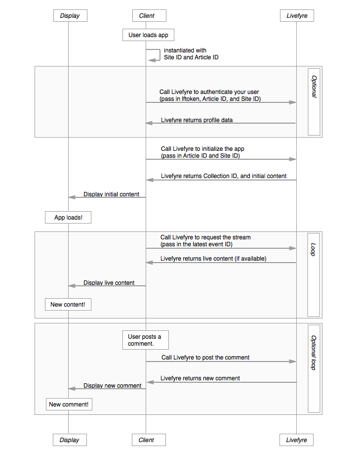

# Architecture{#architecture}

Découvrez les conventions Livefyre et comment Livefyre organise le contenu.

Cette section présente une vue d&#39;ensemble de l&#39;architecture réseau Livefyre.

## Présentation des réseaux et des sites

Livefyre organise les utilisateurs et le contenu par réseau et par site. Chaque réseau peut être associé à un ou plusieurs comptes d&#39;utilisateurs et chaque réseau peut inclure un ou plusieurs sites Livefyre. Un site Livefyre est un regroupement arbitraire de collections. Une collection correspond à un ID d’article dans votre CMS.

## Présentation des réseaux {#section_hqt_4m4_xz}

Les clients avec plusieurs domaines peuvent partager des comptes d’utilisateurs sur tous les domaines, en utilisant un réseau Livefyre unique. Les clients qui souhaitent conserver des comptes d’utilisateurs distincts pour différents domaines auront besoin de réseaux Livefyre distincts.

Les paramètres de configuration peuvent s’appliquer aux sites, réseaux et collections (appelés conversation dans l’illustration ci-dessus).

>[!NOTE]
>
>Certains paramètres ne sont disponibles qu’au niveau du réseau (préférences de notification par courrier électronique, adresse électronique et logos personnalisés par courrier électronique, par exemple). Si vous souhaitez que ces paramètres soient différents pour chaque domaine, vous devez utiliser plusieurs réseaux.

## Présentation des sites {#section_vjw_nm4_xz}

Un site est un regroupement arbitraire d&#39;articles. Le regroupement est utile car il vous permet d’affecter différents modérateurs à différents groupes de contenu. Les modérateurs et les propriétaires peuvent être configurés pour modérer le contenu et configurer les paramètres d’administration au niveau du réseau ou du site. Si vous souhaitez que certains modérateurs n’affichent que certaines collections, celles-ci peuvent être configurées en tant que site Livefyre distinct.

>[!NOTE]
>
>Il n&#39;y a pas de limite au nombre de sites que vous pouvez avoir sous votre réseau personnalisé.

## Diagramme des séquences d’applications {#section_mw2_lm4_xz}

Que vous souhaitiez implémenter une fonction personnalisée avec les points de terminaison fournis par Livefyre ou que vous deviez simplement déboguer un problème, il est utile de comprendre comment fonctionne le flux de demande/réponse de l’application Livefyre.

1. Lorsque votre client accède à votre site, instanciez l’application Livefyre avec l’ID de site et l’ID d’article.
1. Si vous souhaitez authentifier l’utilisateur (utile pour l’évaluation du trafic, ainsi que pour la protection du site), envoyez à Livefyre les informations du site et le jeton Profil utilisateur.
1. Envoyez à Livefyre l’ID de site et l’ID d’article pour initialiser l’application.

   Livefyre renvoie le contenu initial.

   Envoyez ce contenu à la page et affichez l’application.

1. Pour mettre à jour le contenu affiché sur la page, envoyez à Livefyre le dernier ID de Événement de votre page. Si un nouveau contenu est disponible, il sera renvoyé.

   Rechargez votre page avec du nouveau contenu et répétez le processus indéfiniment.

1. Si vous autorisez les utilisateurs à publier du nouveau contenu, déclenchez un événement lorsque du nouveau contenu est publié sur votre site pour le publier sur Livefyre. Livefyre va renvoyer un flux mis à jour, que vous pouvez utiliser pour mettre à jour votre site.
