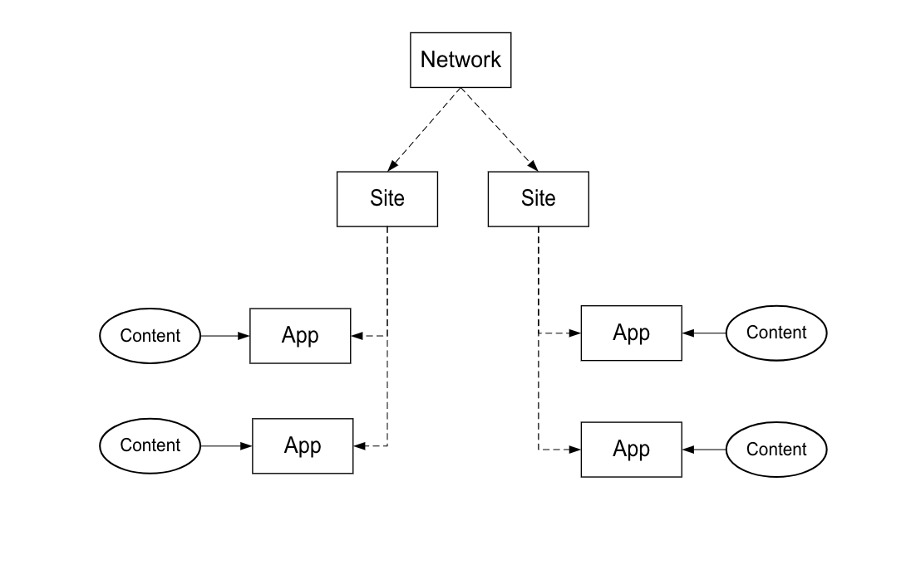

# Processus de mise en œuvre{#implementation-process}

La durée de mise en oeuvre de Livefyre dépend de votre mise en oeuvre et de l’étendue de votre travail.

## Présentation de l&#39;architecture réseau Livefyre {#section_dgj_l32_rbb}

Livefyre utilise les termes suivants pour parler de l&#39;architecture du réseau :

* Réseau. Domaine de niveau supérieur sur lequel vous envisagez d’utiliser Livefyre.
* Sites. Sous-domaine ou section de site qui fait partie du réseau.
* Applications. Rendu du contenu sur votre site. Le contenu s’affiche visuellement dans les applications, à l’aide des applications de visualisation (mosaïque, carrousel, carte de fonctions, etc.). ou au format texte, à l’aide des applications de conversation (commentaires, commentaires, commentaires, conversations, etc.). Vous pouvez placer une ou plusieurs applications sur vos sites.
* Flux. Les flux sont des filtres qui effectuent des recherches sur les médias sociaux et d’autres sites pour rassembler automatiquement du contenu à des fins de modération ou de publication directe dans une application.
* Contenu (par exemple, UGC, commentaires). Ce qui s’affiche dans les applications. Le contenu peut être visuel (par exemple, une photo ou une vidéo), audio uniquement ou texte.

Le diagramme suivant illustre la relation entre le réseau, les sites, les applications et le contenu.

Vous disposez de votre propre instance Livefyre, qui est votre tableau de bord central pour la modération de contenu, la gestion des utilisateurs, etc. Contactez votre CSM pour accéder à votre instance Livefyre.

## Étapes d’intégration {#section_s2j_d2x_tz}

Il y a trois étapes principales pour intégrer Livefyre :

* Intégration d’applications

   Lorsque vous implémentez Livefyre, le style d’implémentation dépend de votre cas d’utilisation. Pour [en savoir plus sur chaque type d’implémentation](/help/implementation/c-getting-started/c-implementation-process/c-app-integration-types.md#c_app_integration_types).

* Intégration d’authentification

   Vous devez intégrer votre système de gestion des utilisateurs existant à Livefyre pour les applications de conversation et toutes les autres applications nécessitant une authentification de l’utilisateur final sur votre site. Si vous n’utilisez pas actuellement d’outil de gestion des utilisateurs, vous pouvez utiliser l’identité Livefyre. Pour [plus d&#39;informations sur l&#39;identité Livefyre, ce qu&#39;elle est et comment la configurer](/help/implementation/c-livefyre-identity-comp/c-livefyre-identity-comp.md#c_livefyre_identity).

* Personnalisation

   La personnalisation est facultative, mais la plupart des clients personnalisent les applications en fonction de leur marque.

