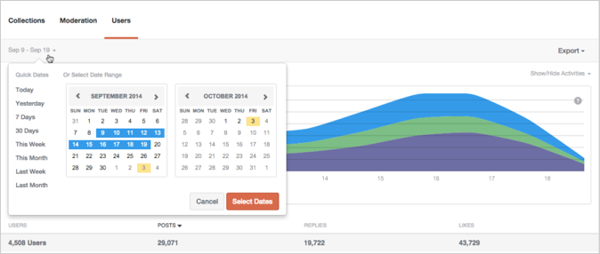
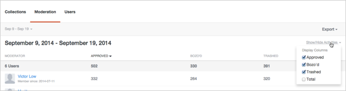
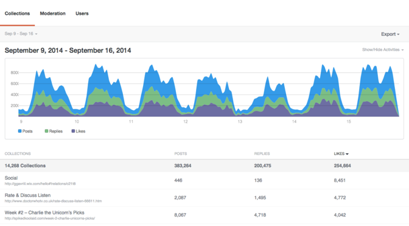
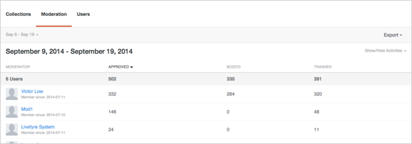
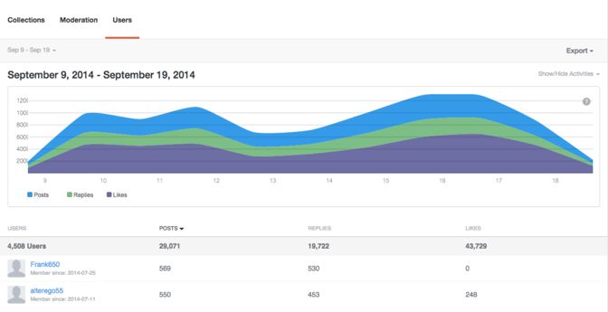

# Analytics{#analytics}

Analyser l'activité des utilisateurs, du contenu et du modérateur pour votre site.

## Analytics {#topic_22D8FAE581CD440EA02B1595520F60C2}

Analyser l'activité des utilisateurs, du contenu et du modérateur pour votre site.

Livefyre Analytics permet d'accéder aux données réseau dans des tableaux de bord faciles à lire pour les données Conversation, Modération et Utilisateur. Utilisez ces tableaux de bord pour surveiller l'activité et exécuter des analyses rapides sur vos sites.

Les tableaux de bord peuvent être filtrés par site, par date et par activité. Utilisez la conversion réseau en haut à gauche de la fenêtre pour sélectionner un site à afficher. Une fois la campagne générée, cliquez sur un en-tête de colonne pour le trier ou placez le pointeur de la souris sur le graphique pour obtenir des informations plus spécifiques sur n'importe quel point de données.

Cette page décrit :

* Sélection d'une plage [de dates](https://answers.livefyre.com/livefyre-studio-version-1/studio/analytics/#DateRange) pour votre tableau de bord
* [Affichage/masquage des activités disponibles](https://answers.livefyre.com/livefyre-studio-version-1/studio/analytics/#ShowHideActivities)
* [Exportation des données du tableau de bord](https://answers.livefyre.com/livefyre-studio-version-1/studio/analytics/#ExportDashboardData)
* [Tableau de bord Collections](https://answers.livefyre.com/livefyre-studio-version-1/studio/analytics/#CollectionsDashboard)
* [Tableau de bord Modération](https://answers.livefyre.com/livefyre-studio-version-1/studio/analytics/#ModerationDashboard)
* [Tableau de bord Utilisateurs](https://answers.livefyre.com/livefyre-studio-version-1/studio/analytics/#UsersDashboard)

>[!NOTE]
>
>Analytics prend actuellement en charge les activités provenant des applications principales Livefyre et de modération. La plupart des activités incluses dans ces tableaux de bord sont également disponibles via [les événements JavaScript Livefyre](https://answers.livefyre.com/developers/reference/app-customizations/javascript-events/)qui peuvent servir à alimenter votre propre outil d'analyse personnalisé ou tiers.

## Période {#concept_798C438120E643B6BE262C9997DC87C4}

Cliquez sur la date d'extraction pour sélectionner une plage à afficher. Utilisez les dates rapides ou sélectionnez une date de début et de fin dans les calendriers fournis.

Dates rapides :

* **Aujourd'hui :** Affiche les données de minuit le matin du jour en cours, jusqu'à la dernière heure complète avant ce moment.
* **Hier :** Affiche les données de 24 heures précédentes.
* **7 jours :** Affiche les données de 7 jours précédents, sans inclure aujourd'hui.
* **30 jours :** Affiche les données de 30 jours précédents, sans inclure aujourd'hui.
* **Cette semaine :** Affiche les données de minuit le matin du dernier dimanche, jusqu'à la dernière heure complète avant ce moment.
* **Ce mois-ci :** Affiche les données de minuit le matin du premier jour du mois en cours, jusqu'à la dernière heure complète avant ce moment.
* **Semaine dernière :** Affiche les données de la semaine dernière.
* **Mois dernier :** Affiche les données du mois dernier.

## Affichage/masquage des activités {#concept_022D9851CBCE4A2FB80D0AE52A23744D}

Les activités sont des actions que les utilisateurs effectuent sur votre site, y compris l'ajout de commentaires, le marquage, le partage et la modération. Utilisez la conversion **Afficher/Masquer les activités** pour sélectionner les activités à inclure dans votre tableau de bord.

>[!NOTE]
>
>La sélection de nouveaux événements pour le filtre génère de nouveau la page sans modifier l'URL.

Les activités disponibles varient selon le type et l'exportation des tableaux de bord et peuvent inclure :

* **Publications :** Affiche les données de minuit le matin du jour en cours, jusqu'à la dernière heure complète avant ce moment.
* **Réponses :** Affiche les données de 24 heures précédentes.
* **Mentions J'aime :** Affiche les données de 7 jours précédents, sans inclure aujourd'hui.
* **Mentions Je n'aime pas :** Affiche les données de 30 jours précédents, sans inclure aujourd'hui.
* **Contient le média :** Affiche les données de minuit le matin du dernier dimanche, jusqu'à la dernière heure complète avant ce moment.
* **Publication avec téléchargement de photo :** Affiche les données de minuit le matin du premier jour du mois en cours, jusqu'à la dernière heure complète avant ce moment.
* **La publication comporte un lien :** Affiche les données de la semaine dernière.
* **La publication comporte @ mentions :** Affiche les données du mois dernier.
* **Approuvé :** Affiche les données du mois dernier.
* **Bozo'd :** Affiche les données du mois dernier.
* **Tronqué :** Affiche les données du mois dernier.
* **Total de la modération :** Affiche les données du mois dernier.

## Exportation des données du tableau de bord {#concept_730DB61A9F894BE6BFB34E0E2A421ED3}

Utilisez le menu déroulant **Exporter** pour exporter les données de vos tableaux de bord au format CSV.

* Résumé quotidien (collections uniquement) : exporte les talons quotidiens de la dernière semaine complète pour chaque collection.
* Données tabulaires : exporte toutes les données Collections cumulées (toutes les colonnes et toutes les lignes du rapport actuel).
* Données brutes : exporte tous les événements individuels qui ont été utilisés pour créer le rapport cumulé actuel.

>[!NOTE]
>
>Ces rapports peuvent prendre quelques minutes à exporter. Tous les horodatages sont l'heure Unix.

## Collections {#concept_228D8E5553784DB8BABF3819A5FF0345}

Le tableau de bord Collections répertorie l'activité des utilisateurs par collection, ce qui vous permet de déterminer le contenu engageant le plus (et le moins). Chaque collection répertoriée comprend un lien vers la page sur laquelle elle est trouvée.

## Modération {#concept_98689B1E804B43CEA21E3F456107CCD9}

Le tableau de bord Modération répertorie les événements par modérateur, ce qui vous permet d'évaluer leur activité. Utilisez ce rapport pour trouver vos modérateurs les plus actifs et leurs actions de modération les plus courantes.

>[!NOTE]
>
>Les activités de modération automatisée Livefyre sont répertoriées pour le nom du modérateur Livefyre System.

## Utilisateurs {#concept_D1A83E31C7B5467F9C844CBF9A740E12}

Le tableau de bord Utilisateurs affiche l'activité du site par utilisateur, ce qui vous permet d'analyser comment les utilisateurs interagissent avec votre site. Utilisez ce tableau de bord pour identifier les utilisateurs les plus actifs sur votre site et pour évaluer les activités sur le site les plus populaires.

