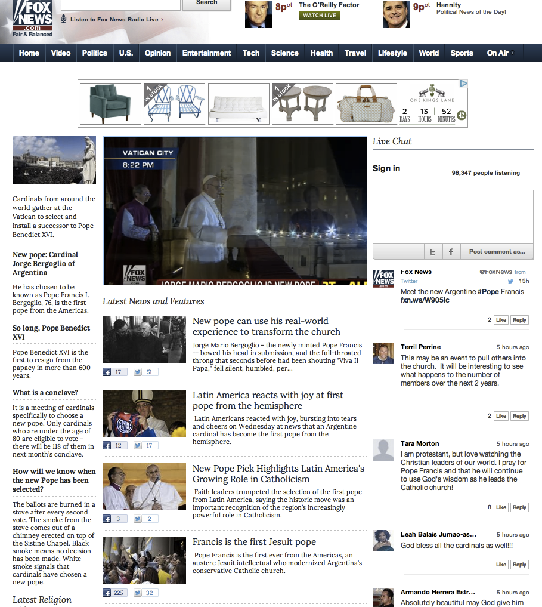

# Chat{#chat}

Activez la messagerie instantanée sur vos sites.

La messagerie instantanée permet aux utilisateurs d’engager une conversation en temps réel autour d’événements, d’annonces ou de spectacles en direct. Le contenu s’affiche sous la forme d’un flux continu de conversation non thread afin de faciliter un engagement rapide et de dynamiser l’activité sur la page.

Fox News a utilisé Chat pour capturer l'opinion du public et la réflexion autour de l'élection du Pape Bergoglio. Sachant qu'il y aurait une augmentation de la participation active et pertinente, Fox News a lancé un Chat dans les minutes qui ont suivi l'annonce pour créer une conversation immédiate.

