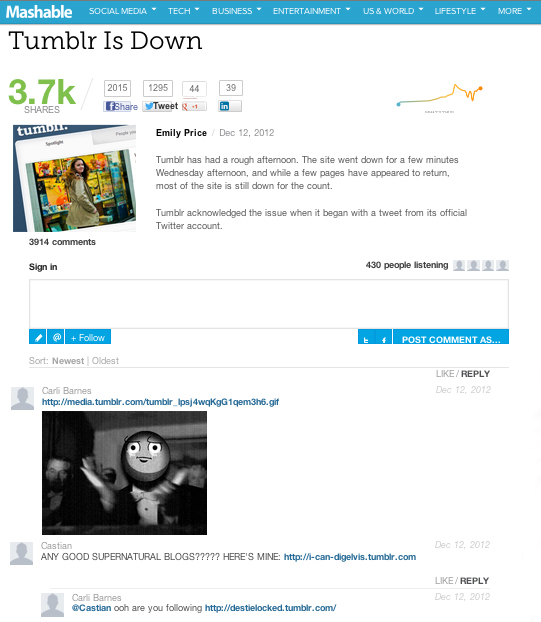

# Commentaires{#comments}

Incorporez des commentaires en temps réel dans votre application.

Les commentaires remplacent vos commentaires par défaut par des conversations en temps réel. Nos fonctions d’intégration sociale permettent de capturer facilement toutes les conversations sur vos publications sur Twitter et Facebook, et d’attirer les amis des utilisateurs dans la conversation.

Machable utilise les commentaires pour accroître la participation des utilisateurs à leurs discussions. Les fonctions de téléchargement de média enrichi, de partage sur les réseaux sociaux, de nombre d’écouteurs et de connexion unique aident à faciliter et à divertir la conversation.

<!-- 

c_comments_app.dita

 -->

