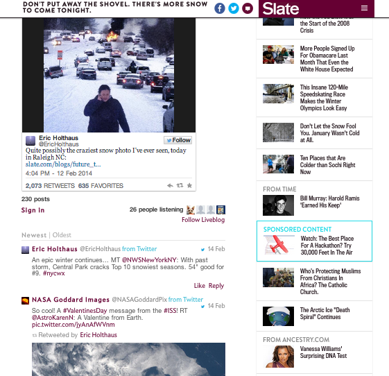

# Blog en direct{#live-blog}

Le blog en direct permet à vos auteurs et éditeurs de publier des mises à jour en temps réel, transformant votre site en une source d&#39;actualités en direct attrayante.

Les publications de votre équipe, riches en images, vidéo, audio et contenu incorporé, deviennent la source de nouvelles conversations et de nouveaux fils d&#39;actualité. Le blog en direct est parfait lorsqu&#39;il est déployé pour les produits révélés, les récompenses et les événements sportifs.

Le blog en direct est différent des commentaires comme suit :

* Seuls les propriétaires et les modérateurs peuvent afficher la zone de commentaire et créer des publications de niveau supérieur.
* Les réponses utilisateur peuvent être désactivées pour créer une expérience de journalisation uniquement.
* Les utilisateurs peuvent écrire, télécharger des photos ou publier des liens pouvant être incorporés à partir de leur ordinateur ou de leur périphérique mobile.
* La police de commentaire est plus grande et les avatars sont plus petits pour mettre en évidence le contenu.
* Si vous le souhaitez, vous pouvez désactiver les avatars.

Avec une autre tempête de neige à venir, Slate souhaitait fournir aux lecteurs des mises à jour instantanément sur les nuances sauvages sur la côte Est. A l&#39;aide d&#39;un blog en direct, les éditeurs Slate ont pu partager instantanément des mises à jour sur la tempête, y compris leurs propres photos, les tweets utilisateur et les informations sur les chutes de neige. Le blog en direct était tellement utile qu&#39;il faisait la première page du site Slate.

