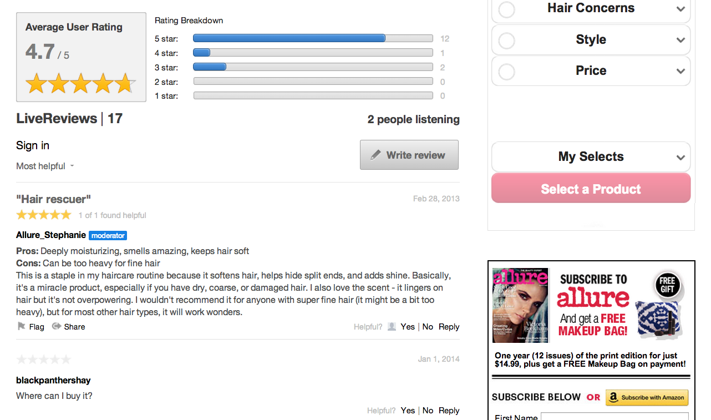

# Révisions{#reviews}

Evaluer et consulter tout élément de contenu sur votre site Web, en temps réel.

Les révisions permettent aux utilisateurs de évaluer et de consulter facilement des produits, des services, des articles ou tout élément de contenu sur votre site Web, en temps réel.

Chaque révision publiée dans une application Révision consiste en un titre de révision de ligne, un corps et une évaluation numérique. En incluant un titre et une évaluation, l'application de révision quantifie l'opinion d'un utilisateur et fournit un résumé de l'expérience de l'utilisateur avec ce produit ou service.

L'application de révision par défaut est composée d'une collection de révisions et d'une section Résumé qui affiche la note d'utilisateur moyenne et la ventilation d'évaluation pour la collection. Les utilisateurs peuvent lire et interagir avec les révisions, en temps réel.

Allure utilise les révisions pour inviter les utilisateurs à contribuer aux classifications et aux opinions sur les produits qu'ils présentent. Grâce aux examens, Allure peut recueillir des commentaires d'utilisateurs précieux et personnels de leur public.

## Fonctionnalités des révisions {#section_awq_xph_21b}

Les révisions proposent plusieurs fonctionnalités spécifiques à cette application.

* Représentation visuelle rapide des tendances (évaluation et résumé de note moyenne) au-dessus du flux.
* Interface de notation personnalisable, dont le nombre d'étoiles et leur image, les sous-parties d'évaluation (telles que les avantages - et - inconvénients) et plusieurs catégories d'évaluation.
* Récapitulez les révisions à l'aide d'une visualisation graphique de la note d'utilisateur moyenne et de la ventilation d'évaluation pour la collection des révisions.
* File d'attente des files d'attente pour affichage, tout en conservant la révision de l'utilisateur en haut de la liste pour leur affichage.
* Permettez aux utilisateurs de voter sur l'aide des révisions, puis sur trier par les évaluations les plus efficaces et/ou les plus élevées.
* Interface compatible avec les dispositifs portables.

