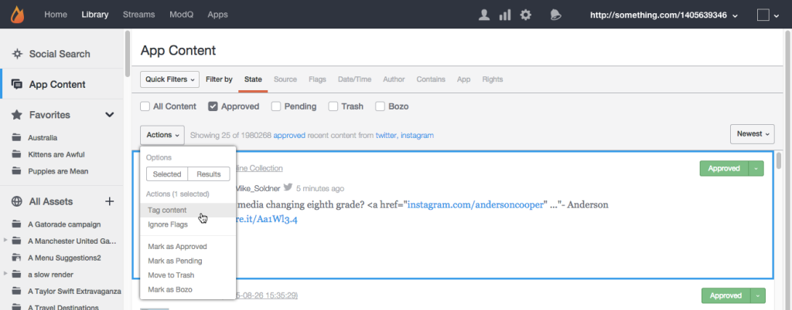
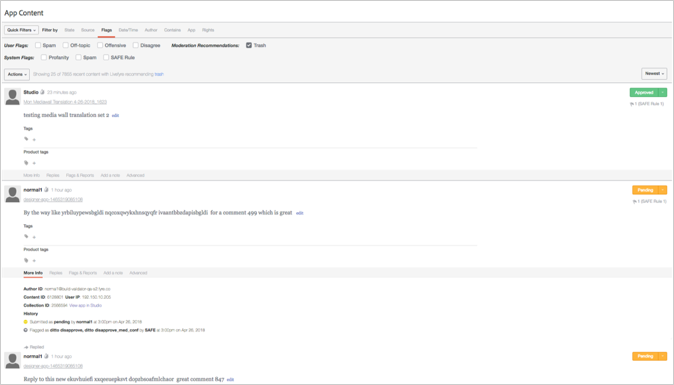
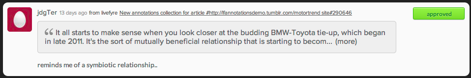

# Modérer le contenu à l'aide du contenu de l'application{#moderate-content-using-app-content}

L'onglet Contenu de l'application de votre bibliothèque vous permet de modérer le contenu publié dans vos applications.

## Modérer le contenu {#section_md5_sqm_zz}

Utilisez le panneau Contenu de l'application pour modérer le contenu répertorié en modifiant son état, en modifiant son état ou en ajoutant une note. Pour modérer le contenu, placez le pointeur de la souris sur le contenu répertorié pour modifier les marqueurs disponibles ou utilisez **[!UICONTROL pulldown]** le menu pour modifier l'état d'un contenu sélectionné ou multiple.

Dans le contenu de l'application, vous pouvez :

* **[!UICONTROL Tag Content]**. Sélectionnez **[!UICONTROL Tag Content]** cette option pour ajouter des balises à une ou plusieurs parties de contenu simultanément.

* **[!UICONTROL Ignore Flags]**. Sélectionnez **[!UICONTROL Ignore Flags]** cette option pour exclure le contenu sélectionné des résultats du filtre de recherche marqués. La sélection **[!UICONTROL Ignore Flags]** d'un élément ne modifie pas son état ; il la supprime simplement des résultats de recherche pour ce filtre de recherche, pour tous les utilisateurs de Studio.

* **[!UICONTROL Change Content Status]**. Cliquez sur un élément de contenu, puis utilisez **[!UICONTROL Actions]** le menu pour modifier son état. (Utilisez la touche Commande ou Contrôle pour sélectionner plusieurs éléments, puis utilisez le menu pour modifier simultanément l'état de plusieurs éléments de contenu.)

   Les options varient selon l'état actuel du contenu répertorié.

   | Etat actuel | Peut être remplacé par |
   |---|---|
   | Approuvé | En attente, Corbeille, Bozo |
   | Bozo | Approuvé, En attente, Corbeille |
   | Corbeille | Approuvé, En attente, Bozo, Supprimer |
   | En attente | Approuvé, Corbeille, Bozo |

* **[!UICONTROL Save as Assets]**. Choisissez **[!UICONTROL Save as Assets]** d'ouvrir la boîte de dialogue Options avancées, à partir de laquelle vous pouvez enregistrer les éléments sélectionnés dans votre bibliothèque de fichiers, les publier dans une application ou demander des droits de réutilisation à son auteur.

* Modération basée sur des recommandations. Utilisez le **[!UICONTROL Moderation Recommendation Indicator]** contenu de l'application pour filtrer le contenu que la recommandation de modération identifie comme susceptible d'être tronquée.

   Dans le contenu de l'application, les recommandations de modération se présentent comme suit : 

## Modérer le contenu des commentaires {#section_i2s_nqm_zz}

L'utilisation des commentaires dans le panneau Contenu diffère de l'utilisation d'autres types de contenu de différentes manières :

* Les onglets Plus d'informations, Réponses, Drapeaux et rapports et Ajouter un pense-bête ne sont pas disponibles.
* Vous ne pouvez pas marquer le contenu des balises Sidenotes, ni le marquer comme indiqué.

Elle diffère également en ce qu'elle affiche non seulement le contenu à modérer ; Il affiche également le texte sélectionné lorsque le fichier Sidenote a été ajouté, ce qui vous permet d'évaluer le contenu en contexte.

Cliquez sur la zone de texte pour la développer afin d'inclure l'intégralité du guillemet sélectionné par l'utilisateur.

La modération du contenu consigne la modération en masse, ainsi que les changements d'état individuels, comme décrit ci-dessus.

## Modérer les utilisateurs Livefyre {#section_grw_mqm_zz}

Placez le pointeur de la souris sur le nom d'utilisateur d'un utilisateur Livefyre pour ouvrir un menu déroulant, ce qui vous permet d'obtenir **[!UICONTROL Ban the User]****[!UICONTROL More Info]**ou d'afficher une liste de leur **[!UICONTROL Comments]**nom. Cliquez sur ce menu pour ouvrir la carte d'informations de l'utilisateur dans **[!UICONTROL Users]** la page Studio.

Pour plus d'informations sur la modération des utilisateurs dans **[!UICONTROL Users]** la page, voir [Modérer les utilisateurs modq](/help/using/c-features-livefyre/c-about-moderation/t-moderate-users-modq.md#t_moderate_users_modq).
