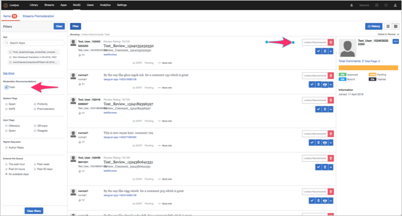

# Règles SAFE{#safe-rules}

Le moteur de filtrage des messages indésirables et des abus de Livefyre (SAFE) est un processus en arrière-plan qui analyse tout le contenu entrant et est activé pour tous les clients Livefyre.

Le logiciel SAFE utilise des règles de schéma ainsi que des modèles statistiques pour détecter les spams, les abus, les obscénités et les publications en masse (répétitives). Il est parfois référencé dans d’autres produits Livefyre, notamment les outils de modération de contenu et ModQ.

>[!NOTE]
>
>SAFE est en anglais uniquement, sauf pour la classification par publipostage. Si vous avez besoin d&#39;une assistance pour d&#39;autres langues, contactez votre gestionnaire de compte stratégique.

## Composants Studio utilisant SAFE {#section_k34_4tx_vy}

Les indicateurs appliqués par SAFE peuvent être utilisés avec les composants Studio suivants :

* Règles

   Vous pouvez définir des règles SAFE pour marquer automatiquement le contenu et définir comment le contenu marqué doit être géré dans **[!UICONTROL Network Settings]**.

   Par exemple, un site peut définir une très faible tolérance pour la profanation et définir des règles SAFE qui définissent Bozo comme étant le nom de tout contenu marqué comme Profane. D’autres sites peuvent définir des règles qui définissent le contenu Profane à prémodérer avant d’entrer dans le flux.

* ModQ

   Vous pouvez modérer le contenu marqué par des règles SAFE et d’autres règles de prémodération (par exemple, SPAM, profanation, etc.), dans le ModQ.

* Contenu de l’application dans la bibliothèque

   Le contenu marqué par SAFE est répertorié dans l&#39;onglet Contenu de l&#39;application **[!UICONTROL Library]**. Vous pouvez filtrer le contenu par indicateurs pour modérer le contenu.

## Options de filtre SAFE {#section_pg5_ttx_vy}

SAFE applique les indicateurs suivants au contenu filtré et peut être utilisé pour créer des règles et modérer le contenu à partir de Livefyre Studio.

* **[!UICONTROL Profanity List]**: Contenu professionnel, tel que défini par une liste de mots-clés anglais, selon une utilisation courante.

   Le filtre de Profanité recherche une langue de profane, basée sur une liste de mots testée. Si elle est détectée, le contenu est marqué Profane.

   >[!NOTE]
   >
   >Livefyre fournit également un second filtre de Liste Profanity, que vous pouvez personnaliser aux niveaux du site et du réseau. Les règles créées avec la Liste Profanité ont priorité sur les règles automatisées provenant du filtre Profanité SÛRE. Pour plus d&#39;informations, reportez-vous à la section Profanity Liste de la documentation des paramètres.

* **[!UICONTROL Mild Profanity]**: Les mots et les expressions ne sont généralement pas acceptables dans les conversations polies, mais sont généralement acceptables dans les conversations informelles. En général, ces mots et expressions sont autorisés sur les chaînes de télévision.
* **[!UICONTROL Strong Profanity]**: Langage très fort, comme les expressions et les extraits interdits sur la télévision en réseau et utilisés avec modération dans les films cotés en R et les émissions de télévision câblée matures. En général, ces mots ne sont pas utilisés dans les conversations polies ou fortuites et sont prononcés dans une conversation impolie avec l&#39;intention de nuire à l&#39;auditeur.
* **[!UICONTROL SPAM]**: Contenu non sollicité, généralement commercial. Il utilise un modèle statistique qui s&#39;appuie sur diverses fonctionnalités (y compris le contenu des commentaires et les URL) pour signaler un élément de contenu comme SPAM. Vous pouvez ajuster les seuils de spam pour personnaliser les taux de balisage SPAM pour votre réseau ou site, sur demande.
* **[!UICONTROL Mild Insult]**: Insulter du contenu, tel que défini par une liste de mots-clés et de schémas d’expressions.
* **[!UICONTROL Strong Insult]**: Insulter du contenu, tel que défini par une liste de mots-clés et de schémas d’expressions.
* **[!UICONTROL Hate Speech]**: Une insulte fondée sur l&#39;ethnie ou la religion, en particulier lorsque l&#39;affiliation à la Population cible est en minorité ou protégée.
* **[!UICONTROL ALL CAPS]**: Texte présenté dans toutes les lettres majuscules (lire comme criant).
* **[!UICONTROL Mild Threat]**: Une menace ou une insulte qui comprend habituellement une sorte de profanation modérée dirigée contre une autre personne. Cette option signale plus souvent les menaces possibles, mais présente également un taux de faux positifs plus élevé que **[!UICONTROL Strong Threat]**.

* **[!UICONTROL Strong Threat]**: Menace ou insulte grave qui mentionne des lésions corporelles pouvant faire l&#39;objet d&#39;une action contre une ou plusieurs personnes, souvent avec une forte propension. Cette option signale moins souvent les menaces possibles, mais présente également un taux de faux positifs inférieur à **[!UICONTROL Mild Threat]**.

* **[!UICONTROL Probable Nudity]**: Une image qui peut avoir de la nudité. Cette option indique la nudité moins souvent, mais présente également un taux de faux positifs inférieur à **[!UICONTROL Possible Nudity]**.

* **[!UICONTROL Possible Nudity]**: Une image qui peut avoir de la nudité. Cette option signale la nudité plus souvent, mais présente également un taux de faux positifs plus élevé que **[!UICONTROL Probable Nudity]**.

* **[!UICONTROL PII]** (Informations identifiables sur le plan personnel) : Informations permettant d’identifier l’utilisateur. Il peut s’agir d’une adresse électronique, d’une adresse physique, d’un numéro de sécurité sociale (pour les clients américains), d’un numéro de carte de crédit, d’un mot de passe ou de tout autre élément pouvant être utilisé dans une fraude ou pour obtenir l’identité d’une personne.
* **[!UICONTROL Livefyre Recommends Trash]**. Définissez l’action que le système effectue lorsque la recommandation de modération automatisée identifie le contenu pour rejet.  

   >[!NOTE]
   >
   >Pour activer le Recommendations de modération, contactez votre professionnel de l’assistance Adobe Livefyre.

## Gestion du contenu non détecté par SAFE {#section_pjy_5tx_vy}

Il existe plusieurs moyens pour gérer efficacement le contenu qui n’est pas détecté par ce filtre. Les options ci-dessous sont répertoriées dans l’ordre de processus recommandé.

1. En tant que modérateur, supprimez le contenu du flux.
1. Créez une règle d’indicateur qui indique si un élément de contenu est signalé comme indésirable ou offensant par cinq utilisateurs, définissez-le sur Bozo.
1. Interdire à l&#39;utilisateur qui publie du contenu indésirable, de sorte que tout son contenu ira directement dans l&#39;état de Bozo.
1. Ajoutez des mots spécifiques qui doivent toujours être filtrés dans votre liste de profanation.

>[!NOTE]
>
>Si un modérateur publie du contenu qui est détecté par notre filtre de messages indésirables, il est toujours signalé comme indésirable, mais est automatiquement Approuvé, et ne sera pas défini sur Bozo.

Si vous remarquez des tendances ou des schémas de contenu qui ne sont pas détectés par SAFE, envoyez un courrier électronique à vos CSM avec les ID de commentaire et le texte.

Applications qui utilisent cette fonctionnalité :

* [Carrousel](/help/using/c-about-apps/c-carousel-app/c-carousel-app.md#c_carousel_app)
* [Chat](/help/using/c-about-apps/c-chat-app/c-chat-app.md#c_chat_app)
* [Commentaires](/help/using/c-about-apps/c-comments/c-comments.md)
* [Carte des fonctionnalités](/help/using/c-about-apps/c-feature-card-app/c-feature-card-app.md#c_feature_card_app)
* [Carte](/help/using/c-about-apps/c-map-app/c-map-app.md#c_map_app)
* [Mur multimédia](/help/using/c-about-apps/c-media-wall-app/c-media-wall-app.md#c_media_wall_app)
* [Mosaïque](/help/using/c-about-apps/c-mosaic-app/c-mosaic-app.md#c_mosaic_app)
* [Critiques](/help/using/c-about-apps/c-reviews-app/c-reviews-app.md#c_reviews_app)
* [Sidenotes](/help/using/c-about-apps/c-sidenotes-app/c-sidenotes-app.md#c_sidenotes_app)
* [Storify 2](/help/using/c-about-apps/c-storify2/c-storify2.md#c_storify2)
* [Bouton Télécharger](/help/using/c-about-apps/c-upload-button-app/c-upload-button-app.md#c_upload_button_app)

