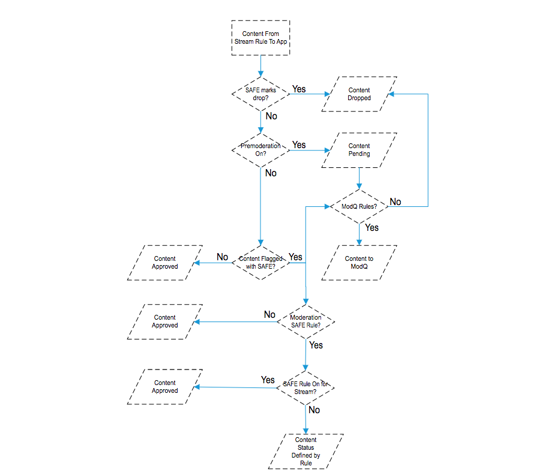
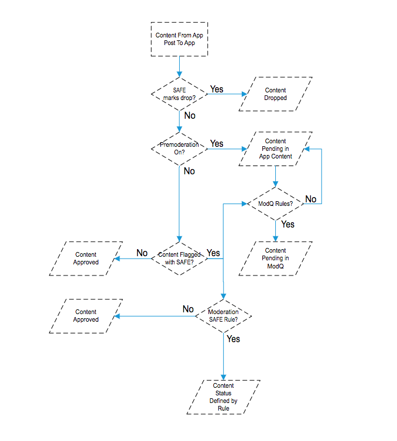
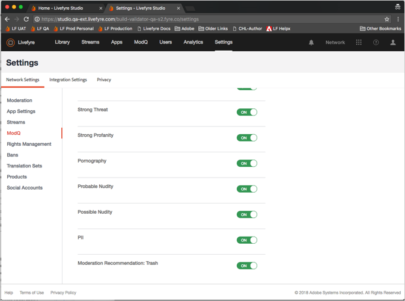
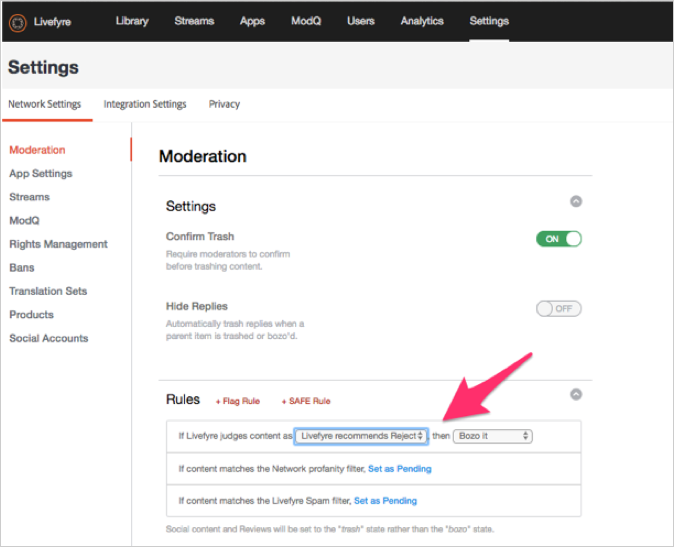

# Configuration de la modération{#setting-up-moderation}

Utilisez l’onglet Modération pour définir des règles de prémodération pour le contenu entrant, notamment les listes de profil, les règles d’indicateur et les adresses IP interdites.

## Fonctionnement de la modération {#section_kyf_gvc_t1b}

Vous pouvez modérer le contenu comme suit :

* Prémodérez automatiquement le contenu pour filtrer le contenu indésirable en fonction des règles que vous avez définies avant de publier le contenu.
* Supprimez ou approuvez manuellement le contenu marqué à l’aide de la prémodération automatique à l’aide de Marketing Cloud ou du contenu de l’application dans la bibliothèque.
* Identifiez les visiteurs du site qui publient régulièrement du contenu offensant afin de les empêcher de publier en interdisant certains utilisateurs, utilisateurs de réseaux sociaux ou adresses IP de Livefyre.
* Identifiez les personnes et le contenu qui peuvent toujours s’afficher en listant les utilisateurs ou en désactivant les filtres pour des flux, sites ou réseaux spécifiques.

Vous pouvez automatiquement prémodérer le contenu de l’une des manières suivantes :

* Configurez des règles pour marquer automatiquement certains types de contenu :

   * Définissez des règles d’indicateur pour le contenu marqué par les visiteurs du site à l’aide de **[!UICONTROL Settings > Moderation > Rules]**
   * Configuration de règles SAFE à l’aide de **[!UICONTROL Settings > Moderation > Rules]**
   * Interdire l’utilisation d’utilisateurs Twitter spécifiques **[!UICONTROL Settings > Streams]**
   * Interdire les adresses IP à l’aide de **[!UICONTROL Settings > Bans]**
   * Interdire les régions IP par code de pays sur demande. Le contenu interdit sera marqué comme SPAM.

* Créez une liste de mots que vous considérez comme profanation dans la liste des bénéfices sous **[!UICONTROL Settings > Moderation > Rules]** pour votre réseau ou site.
* Utilisateurs de la liste blanche (toujours autoriser l’affichage du contenu de ces utilisateurs) en utilisant ou en désactivant les filtres pour des flux, sites ou réseaux spécifiques.

Après avoir configuré vos listes de profanation, vos filtres SAFE et vos règles, vous pouvez choisir de prémodérer le contenu et d’appliquer les filtres SAFE dans les flux. Pour plus d’informations, voir Options des règles de [diffusion en continu pour toutes les règles](/help/using/c-streams/c-stream-rule-options-for-all-stream-rules.md#c_stream_rule_options_for_all_stream_rules)de diffusion en continu.

Livefyre marque le contenu comme **[!UICONTROL Approved]**, **[!UICONTROL Pending]**, **[!UICONTROL Junk]**, etc. selon l’origine du contenu, l’endroit où il sera publié et les règles que vous avez configurées dans votre système. Le tableau suivant décrit en détail les actions entreprises par Livefyre, selon ces facteurs.

## Fonctionnement de la modération

| Le Contenu Provient De : | Envoi de contenu à : | Statut d'approbation |
|--- |--- |--- |
| Bibliothèque | Appli | Contenu approuvé |
| Recherche sociale | Appli | Contenu approuvé |
| Règle de diffusion | Appli | Le contenu est-il marqué comme indésirable par le filtre SAFE ?  <ul><li>Non - Processus de modération de flux vers l’application</li><li>Oui - Contenu copié</li></ul> |
| Bibliothèque | Dossier | Aucun état (dans le dossier, pas publié, pas supprimé) |
| Recherche sociale | Dossier | Aucun état (dans le dossier, pas publié, pas supprimé) |
| Règle de diffusion | Dossier | Le contenu est-il marqué comme indésirable par le filtre SAFE ?  <ul><li>Non - Aucun état (dans le dossier, pas publié, pas supprimé)</li><li>Oui - Contenu copié</li></ul> |
| Publication de l’application | Appli | Le contenu est-il marqué comme indésirable par le filtre SAFE ?  <ul><li>Non - Processus de modération post-application</li><li>Oui - Contenu copié</li></ul> |

## Processus de modération de flux vers l’application {#section_z5z_w4d_t1b}

Avant que le contenu d’un flux ne soit publié dans une application, Livefyre effectue les vérifications suivantes pour déterminer ce qu’il faut faire avec le contenu :

1. Si SAFE désigne le contenu comme indésirable ou déposé, Livefyre le corrompt.
1. Si SAFE ne désigne pas le contenu comme indésirable, Livefyre vérifie si la prémodération est activée.
1. Si la prémodération est activée, Livefyre marque le contenu comme étant en attente.
1. Si vous configurez des règles ModQ, Livefyre envoie le contenu à ModQ.
1. Si la prémodération n’est pas activée, Livefyre vérifie si SAFE a marqué le contenu.
1. Si SAFE a marqué le contenu, Livefyre l’approuve et le publie dans l’application.
1. Si SAFE marque le contenu et que vous n’avez pas défini de règles SAFE, Livefyre approuve le contenu et le publie dans l’application.
1. Si SAFE marque le contenu et que vous configurez des règles SAFE, Livefyre vérifie si vous avez configuré des règles SAFE pour le flux.
1. Si vous définissez des règles SAFE pour le flux, Livefyre approuve le contenu et le publie dans l’application. Si vous n’avez pas configuré de règles SAFE pour le flux, Livefyre utilise les règles SAFE de modération pour déterminer comment gérer le contenu (envoyer à ModQ, corbeille, etc.).

## Processus de modération post-application {#section_fwn_w4d_t1b}

Avant que le contenu d’une publication d’application ne soit publié dans une application, Livefyre effectue les vérifications suivantes pour déterminer ce qu’il faut faire avec le contenu :

1. Si le filtre SAFE marque le contenu comme une goutte d’eau, Livefyre supprime le contenu.
1. Si SAFE ne signale pas le contenu comme une goutte, Livefyre vérifie si la prémodération est activée. Si la prémodération est activée, Livefyre marque le contenu comme étant en attente. Si vous configurez des règles ModQ, Livefyre envoie le contenu à ModQ comme étant en attente. Dans le cas contraire, le contenu reste dans un état en attente dans Contenu de l’application dans la bibliothèque.
1. Si la prémodération n’est pas activée, Livefyre vérifie si SAFE a marqué le contenu. Sinon, Livefyre approuve le contenu et le publie dans l’application.
1. Si SAFE marque le contenu et que vous configurez des règles SAFE, Livefyre utilise la règle SAFE pour déterminer comment gérer le contenu (envoyer à ModQ, corbeille, etc.). Si SAFE marque le contenu et que vous n’avez pas défini de règles SAFE, Livefyre approuve le contenu et le publie dans l’application.

## Filtres en masse {#section_lyk_ktx_vy}

Le filtre en masse recherche le contenu répétitif publié sur tous les réseaux Livefyre dans un délai court. S’il est détecté, ce contenu est marqué comme étant en bloc, puis est placé en mémoire tampon par défaut. Bien que le contenu en vrac puisse être généré par l’utilisateur (comme "Touchdown!") publié à plusieurs reprises dans un Chat lors d'un match de football populaire), la plupart sont nés de campagnes de spam. Ce filtre est indépendant de la langue et fonctionne avec n’importe quelle langue. Pour personnaliser le filtre en vrac, vous devez contacter l’assistance Livefyre.

## Règles {#section_gqz_ksk_f1b}

Utilisez la section Règles pour créer des règles de prémodération en fonction des indicateurs SAFE et appliqués par l’utilisateur. Ce panneau propose deux types de règles :

* **[!UICONTROL Flag Rules:]** spécifiez une action à exécuter sur un commentaire marqué par les utilisateurs un nombre défini de fois.
* **[!UICONTROL SAFE Rules:]**combiner des indicateurs SAFE avec des actions pour exécuter le contenu marqué.

Pour créer des règles d’indicateur, sélectionnez l’indicateur (Offensive, Désactivé la rubrique, En désaccord ou Indésirable), entrez le nombre de fois où il doit être appliqué à un élément de contenu, puis sélectionnez l’action à exécuter. Vous pouvez définir une règle d’indicateur pour chaque option d’indicateur (Offensive, Désactivé la rubrique, En désaccord ou Indésirable).

Vous pouvez créer des règles aux niveaux Réseau, Site et Flux. Les règles au niveau du site héritent des règles réseau, sauf si vous les configurez différemment. Les règles de diffusion en continu héritent des règles du site, sauf si vous les configurez différemment.

Actions disponibles :

* **[!UICONTROL Trash it:]**envoie le commentaire marqué à la corbeille.
* **[!UICONTROL Bozo it:]** masque le commentaire marqué de tous les utilisateurs, à l’exception de son auteur, auxquels il reste visible.
* **[!UICONTROL Pending:]** définit le contenu comme étant en attente. Si vous définissez la prémodération sur ON sous **[!UICONTROL Settings > ModQ]**, elle sera dans le ModQ. Dans le cas contraire, il sera uniquement dans Contenu de l’application.

>[!NOTE]
>
>Livefyre vous recommande de créer des règles pour les commentaires Bozo signalés comme indésirables ou offensants par cinq utilisateurs.

## Recommandations de modération {#section_ec3_vr3_2cb}

Vous pouvez utiliser des recommandations de modération pour vous aider à déterminer comment modérer le contenu publié par les visiteurs du site dans les applications Livefyre. L’indicateur de recommandation de modération recommande lorsqu’un élément de contenu risque d’être corrompu, en fonction des actions que vous avez précédemment entreprises sur un contenu similaire. Pour utiliser les recommandations de modération :

1. Activez la fonctionnalité Recommandations de modération en contactant votre professionnel de l’assistance technique Adobe Livefyre.
1. Configurez les recommandations de modération dans Paramètres réseau.

   Configurez les recommandations de modération à l’aide du **[!UICONTROL Livefyre Recommends Trash]** paramètre sous **[!UICONTROL Network Settings]**.

   

1. Configurez une règle SAFE pour indiquer à Livefyre ce qu’il faut faire avec le contenu que la recommandation de modération identifie comme contenu susceptible d’être corrompu. Pour plus d’informations sur la configuration d’une règle SAFE pour l’ **[!UICONTROL Livefyre Recommends Trash]** option, voir [Modération](/help/using/c-features-livefyre/c-about-moderation/c-moderation.md#c_moderation).

   

1. Utilisez la **[!UICONTROL Moderation Recommendation Indicator]** méthode ModQ ou App Content pour filtrer le contenu que la recommandation de modération identifie comme susceptible d’être corrompu.

   Dans ModQ, l’indicateur se présente comme suit :  

   Pour plus d’informations sur l’utilisation des recommandations de modération pour modérer le contenu dans ModQ, voir [ModQ](/help/using/c-features-livefyre/c-about-moderation/c-modq.md#c_modq).

   Dans Contenu de l’application, les recommandations de modération se présentent comme suit :  

   Pour plus d’informations sur l’utilisation des recommandations de modération dans le contenu de l’application, voir [Modération du contenu à l’aide du contenu](/help/using/c-features-livefyre/c-about-moderation/c-moderate-content-using-app-content.md#c_moderate_content_using_app_content)de l’application.
