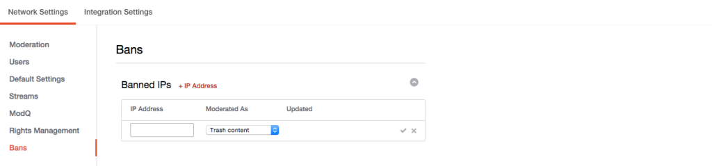

# Interdire les adresses IP{#ban-ip-addresses}

Vous pouvez interdire les adresses IP si un utilisateur malveillant crée plusieurs comptes à partir de la même adresse IP.

Si un utilisateur interdit commence à réaliser que personne ne voit ses commentaires, il peut décider de créer un nouveau compte d&#39;utilisateur, avec un autre nom d&#39;utilisateur et un autre avatar, et commencer à poster des commentaires inappropriés ou indésirables à partir de ce nouveau compte non interdit. Vos modérateurs peuvent reconnaître le contenu comme un même utilisateur et vérifier cette hypothèse en vérifiant l’adresse IP de l’utilisateur qui publie les commentaires (à partir de la page Détails du compte).

1. Cliquez sur **[!UICONTROL + IP Address]** dans le panneau IP interdites.
1. Entrez l’adresse IP dans le champ. Pour interdire une plage d&#39;adresses IP, entrez la plage au format &quot;192.168.0.1 - 192.168.0.10&quot; (séparez les adresses IP par des espaces et un tiret entre guillemets) et cliquez sur **[!UICONTROL Save]**.
1. Sélectionnez une action dans le menu déroulant (contenu Corbeille, Prémodéré ou Bozo).
1. Cliquez sur la coche pour enregistrer.
