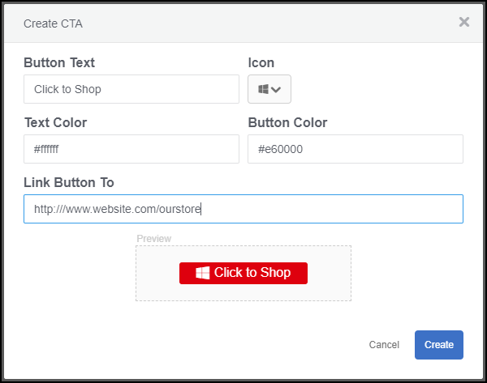
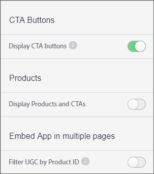

# Bouton d’appel à l’action personnalisé{#custom-call-to-action-button}

## Bouton d’appel à l’action personnalisé {#topic_EBE23A0F827645E0A0C619DCF3872EE5}

Les boutons CTA (Appel à l&#39;action personnalisé) sont des boutons qui peuvent être ajoutés à n&#39;importe quelle ressource de Livefyre Studio pour rendre le contenu utilisable. Ils peuvent diriger un utilisateur final vers une URL personnalisée, telle qu’une page de médias sociaux ou un panier. Les boutons CTA peuvent être créés en plusieurs emplacements dans Livefyre, mais ils sont gérés dans la section **[!UICONTROL Settings]** de Livefyre Studio.

Avec les CTA personnalisées, vous pouvez :

* Ajoutez des boutons CTA personnalisés sur n’importe quel élément UGC de vos murs de médias Livefyre, mosaïques, carrousels, bandes de film et sur des cartes individuelles.
* Contrôlez le message, les icônes, les couleurs, les liens et le nombre de boutons sur chaque élément de l’UGC.
* Créez, gérez et réutilisez des boutons CTA personnalisés dans les paramètres et la bibliothèque.
* Utilisez Adobe Analytics pour mesurer les taux de clics publicitaires.

## Créer un bouton d’appel à l’action personnalisé {#task_C61B4A8E66F24AC19C833612E596B736}

Contexte de la tâche

1. Dans Livefyre Studio, cliquez sur **[!UICONTROL Settings]**.
1. Dans la section de gauche, cliquez sur **[!UICONTROL CTAs]**.

   La bibliothèque CTA s&#39;affiche, où les DEC peuvent être créées et organisées dans des dossiers. 1. Cliquez sur **[!UICONTROL Create CTA]**.
1. Renseignez les champs avec les personnalisations souhaitées et une prévisualisation de boutons s’affichera au bas de l’écran Créer une DEC.

   

1. Cliquez sur **[!UICONTROL Create]**.

   Le bouton CTA est maintenant disponible pour être ajouté à n’importe quel actif.

## Ajouter un bouton d&#39;appel à l&#39;action personnalisé à un actif {#task_36190DD1C8204C7793CB7EEA379C2155}

Ajoutez un bouton CTA à tout élément de contenu de Livefyre Studio.

1. Dans le studio Livefyre, accédez à **[!UICONTROL Library]** > **[!UICONTROL All Assets]**.
1. Sélectionnez un ou plusieurs fichiers dans lesquels ajouter un bouton CTA.
1. Cliquez sur **[!UICONTROL CTAs]**.

   

1. Sélectionnez le bouton CTA de votre choix dans la liste, puis cliquez sur **[!UICONTROL Add]**.

   Le bouton CTA s&#39;affiche désormais sur la ressource sélectionnée.

   >[!NOTE]
   >
   >Pour que les DEC personnalisées que vous associez à chaque ressource s&#39;affichent dans une application, vous devez activer les boutons CTA dans les paramètres de l&#39;application :
   >
   >
