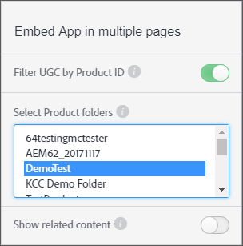

# Filtrer l&#39;UGC par ID de produit {#filter-ugc-product-id}

Le filtrage des CU par ID de produit vous permet d’incorporer la même application sur plusieurs pages tout en affichant des CU spécifiques à chaque produit pour chaque page.

Pour filtrer l’UGC par ID de produit, procédez comme suit :

1. Dans Livefyre Studio, accédez à l’onglet **[!UICONTROL Apps]**.

1. Sélectionnez l’application à modifier.

1. Sélectionnez l’onglet Designer dans le rail de gauche.

1. Activer **[!UICONTROL Filter UGC by Product ID]**.



1. Sélectionnez les dossiers de produits de niveau supérieur qui contiennent le ou les produits dont vous souhaitez filtrer le contenu généré par l&#39;utilisateur.
Utilisez CTRL/Commande + clic pour sélectionner plusieurs dossiers.

1. Désactivez **[!UICONTROL Show related content]**.
Lorsqu’il est activé, le contenu filtré à l’aide de l’attribut `data-lf-attr-product` s’affiche en premier, suivi de tous les autres contenus de l’application.

1. Cliquez sur **[!UICONTROL Publish]**.

1. Insérez les ID de produit par lesquels vous souhaitez filtrer dans le code cible.

>[!NOTE]
>
>Pour localiser les ID de produit, accédez à **[!UICONTROL Settings > Products]**. Recherchez le produit souhaité et sélectionnez-le et l’ID s’affiche.

Par exemple, le code suivant est généré pour une application de mur multimédia :

```
<script type="text/javascript" src="https://cdn.livefyre.com/
Livefyre.js"></script><div class="lf-app-embed" data-lfapp="
59dc41fa-85a5-49ed-8d60-d74616b3ccd1/tagged/published" datalf-
env="prod" data-lf-read-only="" data-lf-attr-product="<product
 1>,<product 2>"></div><script>Livefyre.require(["app-embed#1.0.11"],
 function (appEmbed) {appEmbed.loadAll().done(function(embed)
 {embed = embed[0];if (embed.el.onload && embed.getConfig)
 {embed.el.onload(embed.getConfig());}});});</script>
```

Pour baliser un produit, remplacez `<product 1>` dans l&#39;attribut `data-lf-attr-product` par l&#39;identifiant de produit souhaité. Vous pouvez baliser un ou plusieurs produits en ajoutant des identifiants de produits séparés par des virgules supplémentaires. Les produits doivent se trouver dans le dossier de produit de niveau supérieur ou dans les dossiers sélectionnés à l’étape 5.

Le segment de code modifié s’affiche comme suit :

```
<script type="text/javascript" src="https://cdn.livefyre.com/
Livefyre.js"></script><div class="lf-app-embed" data-lfapp="
59dc41fa-85a5-49ed-8d60-d74616b3ccd1/tagged/published"
 data-lf-env="prod" data-lf-read-only="" data-lf-attrproduct="
109,47"></div><script>Livefyre.require(["app-embed#1.0.11"],
 function (appEmbed) {appEmbed.loadAll().done(function(embed)
 {embed = embed[0];if (embed.el.onload && embed.getConfig)
 {embed.el.onload(embed.getConfig());}});});</script>
```

Désormais, l’application n’affiche que les ID de produit balisés.