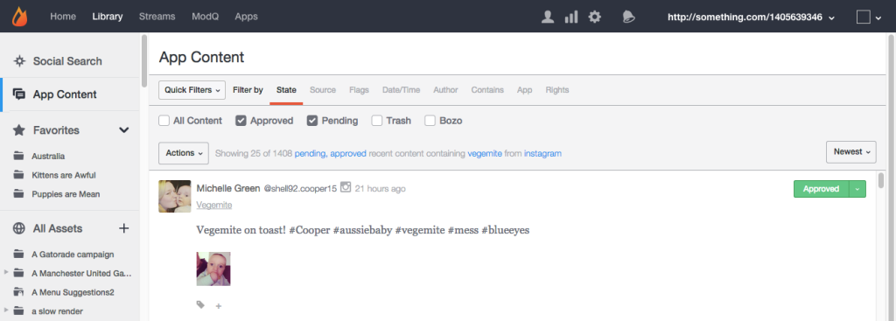
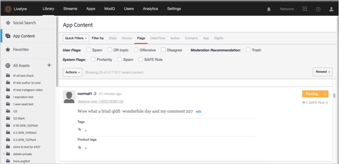
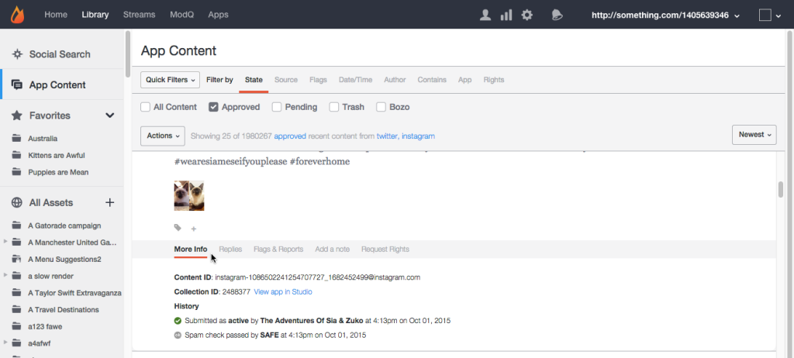
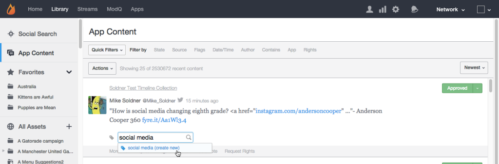

# Onglet Contenu de l’application{#app-content-tab}

Gestion du contenu sur votre réseau Livefyre.

L’onglet Contenu de l’application de votre bibliothèque vous permet de rechercher et de modérer le contenu publié dans vos applications. L&#39;onglet **[!UICONTROL App Content]** permet à plusieurs filtres de recherche de définir plus rapidement et plus facilement les paramètres de recherche.

Utilisez l’onglet Contenu de l’application pour :

* Rechercher du contenu
* Historique du contenu de la vue
* Modération du contenu
* Ajouter une balise
* Contenu des fonctionnalités
* Association de contenu aux produits du catalogue de produits

Pour plus d&#39;informations sur la manière de modérer le contenu à l&#39;aide de l&#39;onglet Contenu de l&#39;application, voir .

## Recherche par caractères génériques {#section_jvr_ntm_zz}

Les champs de recherche Livefyre prennent en charge les caractères génériques, ce qui vous permet d’ajouter un astérisque ( * ) aux mots (ou fragments de mot) pour capturer des correspondances partielles.

Par exemple :

* balle ne retourne que balle
* le ballon* renvoie le ballon et le ballon
* *la balle retourne la balle et le football
* *ball* retourne le ballon et l&#39;uniball et la neige

## Rechercher du contenu {#section_fw1_mtm_zz}

Le panneau Contenu de l’application vous permet de limiter votre recherche en utilisant plusieurs options de filtrage de contenu différentes.

Utilisez la liste déroulante **[!UICONTROL Quick Filters]** pour restreindre le contenu renvoyé à l’état **[!UICONTROL All Content]**, **[!UICONTROL All Sidenotes]**, **[!UICONTROL Approved]**, **[!UICONTROL Approved & Flagged]**, **[!UICONTROL Pending]** ou **[!UICONTROL Rights Requests]**. Sélectionnez ensuite une option **[!UICONTROL Filter by]** et utilisez les cases à cocher ou les champs de saisie disponibles pour restreindre votre recherche.

Utilisez le menu déroulant pour trier le contenu de la liste par **[!UICONTROL Newest]**, **[!UICONTROL Oldest]**, **[!UICONTROL Recently updated]**, **[!UICONTROL Most flags]** ou **[!UICONTROL Most liked]**.

## Filtrer par options {#section_aqn_xqm_zz}

Utilisez la barre **[!UICONTROL Filter by]** pour filtrer selon les options suivantes :

* **** EtatPermet de filtrer selon l’état de modération actuel du contenu :**  [!UICONTROL All Content]**,  **[!UICONTROL Approved]** **[!UICONTROL Pending]** ou  **[!UICONTROL Bozo]** ou.

* **** SourcePermet de filtrer selon la source du contenu. Sélectionnez **[!UICONTROL Livefyre]** pour liste le contenu généré par l’utilisateur et publié directement dans le flux. Sélectionnez **[!UICONTROL Facebook]**, **[!UICONTROL Twitter]** ou **[!UICONTROL RSS]** pour inclure le contenu extrait de ces sources dans vos applications.

* **** IndicateursLa sélection d&#39;indicateurs vous permet de filtrer par  **[!UICONTROL User Flags]** (indésirable, hors sujet, Offensive ou Désaccord),  **[!UICONTROL System Flags]** appliquée par SAFE (Profanité, Indésirable ou Modéré Magiquement), ou  **[!UICONTROL Moderation Recommendations]** par.  

* **Date/** HeureVous permet de déterminer le moment où le contenu a été initialement  **[!UICONTROL Created]** (ou extrait dans l’application par le biais de SocialSync ou d’un flux) ou le dernier  **[!UICONTROL Modified]** (modifié, marqué ou l’état modifié).

* **** AuteurVous permet de filtrer selon l’ **[!UICONTROL IP]** adresse de l’auteur,  **[!UICONTROL Display Name]** (située dans le panneau Utilisateurs ou au-dessus du contenu publié par l’auteur) ou  **[!UICONTROL User ID]**(située dans le panneau Utilisateurs).

* **** Contains (Contient) Permet de filtrer les 90 derniers jours de contenu par  **[!UICONTROL Keyword]** ou  **[!UICONTROL Content Tag]** par. Cochez la case **[!UICONTROL Media]** pour renvoyer uniquement le contenu contenant Media. (Pour rechercher tout le contenu, faites défiler le contenu vers le bas dans la liste, puis cliquez sur **[!UICONTROL Search full data]**.)

   **Remarque : la recherche de** plusieurs mots-clés et balises de contenu n’est pas prise en charge. Si plusieurs mots-clés ou balises sont entrés, le dernier mot est utilisé pour la recherche.

   Lors de la recherche par balise de contenu, les balises suggérées sont automatiquement renseignées lorsque vous entrez dans le champ de recherche. Les résultats de la recherche retourneront tout le contenu auquel la balise a été affectée. (Utilisez ce champ pour rechercher du contenu phare ou cliquez sur le libellé **[!UICONTROL Featured]** sur tout contenu phare de Studio.)

   **Remarque :** utilisez un signe moins (-) avant le nom d’une balise pour rechercher du contenu qui n’inclut pas cette balise. Par exemple : Recherchez &quot;-Miley&quot; pour rechercher tout le contenu qui n’inclut pas la balise &quot;-Miley&quot;.

* **** AppPermet de filtrer par  **[!UICONTROL Collection ID]** identifiant **[!UICONTROL App Tag]**  **parent,** ou identifiant parent. Le filtrage par ID parent renvoie tout le contenu qui est une réponse à l’ID de contenu d’entrée. (Filtrez par plusieurs balises en saisissant des balises séparées par une virgule.)

* **** RightsVous permet de filtrer par statut Demandes de droits :**  [!UICONTROL Requested]**,  **[!UICONTROL Granted]** **[!UICONTROL Replied]** ou  **[!UICONTROL Expired]**.

## Contenu Bozo {#section_afl_vqm_zz}

Dans les applications, le contenu **[!UICONTROL Bozo]** s’affiche uniquement pour l’auteur du contenu. Cela permet à l’utilisateur de croire que son contenu a été approuvé, tout en le masquant à tous les autres utilisateurs et modérateurs.

>[!NOTE]
>
>Le contenu social provenant de SocialSync ou de Streams **[!UICONTROL cannot]** doit être défini sur Bozo.

Vous pouvez Bozo du contenu pour les raisons suivantes :

* Le contenu identifié comme indésirable par SAFE est automatiquement défini sur l&#39;état Bozo.
* Tous les contenus des utilisateurs interdits sont automatiquement définis sur Bozo.
* Le contenu peut être marqué Bozo depuis Studio.
* Les modérateurs peuvent Bozo du contenu directement dans le flux.

## Historique du contenu de la vue {#section_ayz_tqm_zz}

Le panneau de contenu vous permet de consulter l’historique de tout le contenu de la liste, y compris la prémodération, le filtrage des messages indésirables, la date de publication et les indicateurs ou notes utilisateur affectés à l’élément.

Utilisez les onglets situés dans la partie inférieure du panneau de contenu pour vue son historique.

* **[!UICONTROL More Info:]** liste toutes les activités sur ce contenu, y compris l’envoi, la modification, la vérification du spam, la modification de l’état et les notes. L’ID de contenu Livefyre et l’adresse IP de l’utilisateur sont également affichés dans cette section.
* **[!UICONTROL Replies:]** liste un maximum de 6 réponses. Cliquez sur **[!UICONTROL Show all replies]** pour afficher toutes les réponses à la publication.

* **[!UICONTROL Flags & Reports:]** liste tous les indicateurs d’utilisateur, avec l’avatar de l’utilisateur qui a marqué le contenu et tous les rapports (notes ajoutées par l’utilisateur lors du marquage du contenu).
* **[!UICONTROL Add a note:]** vous permet d’ajouter une note visible par d’autres administrateurs ou modérateurs.
* **[!UICONTROL Request Rights:]** ouvre la  **[!UICONTROL New Rights Request]** boîte de dialogue à partir de laquelle une demande de droits peut être émise.

* **[!UICONTROL Save as Asset:]**ouvre la boîte de dialogue **[!UICONTROL Advanced Options]**, qui vous permet d’enregistrer l’élément sélectionné dans votre bibliothèque de fichiers, de le publier sur une application ou de demander des droits de réutilisation à son auteur.

## Ajouter une balise au contenu {#section_xb4_mxr_rdb}

Le balisage du contenu vous permet de classer et d’organiser le contenu pour faciliter la récupération et la personnalisation du style, ou de marquer le contenu comme étant présenté.

Pour ajouter des balises, il vous suffit de cliquer sur l’icône Plus ( **[!UICONTROL +]**) sous Contenu. Saisissez une nouvelle balise ou sélectionnez-la dans une liste de balises existantes.

## Recherche d’images dans tous les fichiers {#section_zxf_hsf_wcb}

Une fois que vous avez ajouté le contenu à la bibliothèque, vous pouvez effectuer des recherches par balises actives.

Dans la bibliothèque, sous Tous les fichiers, vous pouvez rechercher des images existantes en cliquant sur **[!UICONTROL Show Filters]**, puis sur :

* Saisie de texte à rechercher dans le champ de recherche
* Tri par pertinence
* Saisir du texte dans le champ **[!UICONTROL Tags]** pour effectuer une recherche par balises actives. L’algorithme de classement Balises dynamiques filtres le contenu à l’aide d’un score de confiance des balises actives, de la nouveauté du contenu et du nombre d’étoiles qu’un utilisateur a attribué au contenu.

## Contenu proposé {#section_emb_kqm_zz}

Sélectionnez la balise **[!UICONTROL Featured]** par défaut pour marquer le contenu comme présenté et le mettre en évidence comme important pour vos utilisateurs. Une fois balisé, utilisez les options de style personnalisées pour personnaliser le contenu proposé dans vos applications.

## Pour afficher ou désactiver le contenu {#section_ojx_3qm_zz}

* Dans Studio, cliquez sur le signe **[!UICONTROL +]** en regard d’un élément de contenu, sélectionnez la balise **[!UICONTROL Featured]** dans la liste déroulante, puis cliquez sur **[!UICONTROL Enter]** pour afficher le contenu. La balise sera enregistrée et affichée à côté de l’élément de contenu.

* Pour désactiver la fonctionnalité, cliquez sur la balise **[!UICONTROL x]** **[!UICONTROL Featured]** affichée sur l’élément de contenu.

* Dans un commentaire, un blog en direct ou une application de révision, passez la souris sur le contenu que vous souhaitez présenter, puis cliquez sur **[!UICONTROL Feature]**. Pour annuler la fonctionnalité, placez le pointeur de la souris sur le contenu, puis cliquez sur **[!UICONTROL Unfeature]**.

>[!NOTE]
>
>En raison des contraintes d&#39;espace, le contenu de la messagerie instantanée peut uniquement être présenté ou non dans Studio, et ne pas l&#39;être dans l&#39;application elle-même.

## Modification du contenu proposé {#section_pyw_hqm_zz}

La plupart des actions régulières sur le contenu peuvent être effectuées sur le contenu proposé, à l’exception des actions suivantes :

* Le contenu proposé ne peut pas être balisé.
* Les utilisateurs ne peuvent pas modifier leur contenu une fois celui-ci proposé, même s’ils peuvent le supprimer s’ils le souhaitent. Les modérateurs peuvent modifier le contenu proposé.

