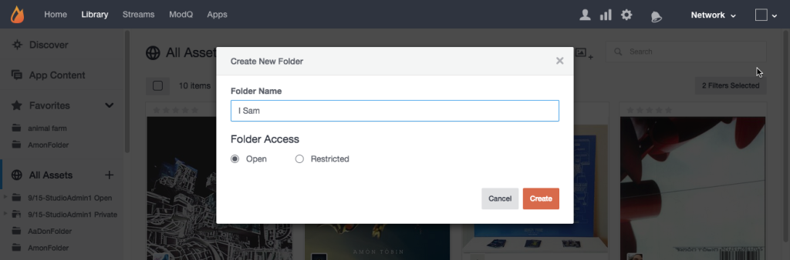

# Créer des dossiers de ressources{#create-asset-folders}

Créez des dossiers pour organiser les fichiers.

La création d’un nouveau dossier l’ajoute à la liste Tous les actifs dans l’ordre alphabétique. Pour ajouter un sous-dossier, sélectionnez d’abord le dossier dans lequel il sera situé, puis cliquez sur l’icône **[!UICONTROL Create New Subfolder]** en haut de la page.

1. Cliquez sur **[!UICONTROL Create new folder]** dans la vue de l’arborescence, saisissez un nom, puis cliquez sur **[!UICONTROL Create]** pour créer le dossier au niveau supérieur de Tous les actifs.
1. Sélectionnez un dossier, puis cliquez sur l&#39;icône **[!UICONTROL Create New Subfolder]** en haut de la page pour ajouter un sous-dossier.
1. Créez un dossier lors de l’ajout de contenu à votre bibliothèque de fichiers à partir de la boîte de dialogue **[!UICONTROL Add to folder > Select folder]**.
