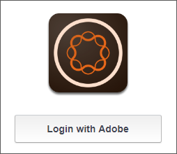
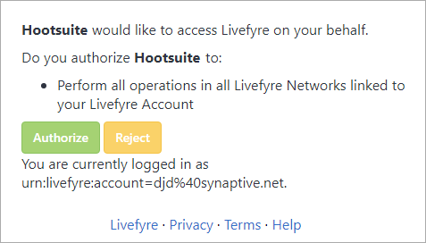
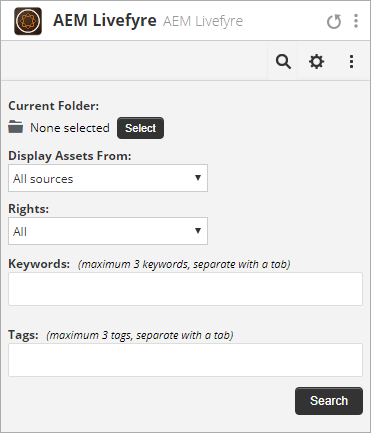
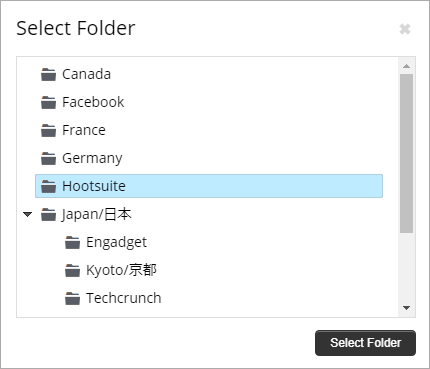
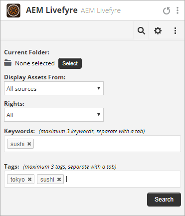
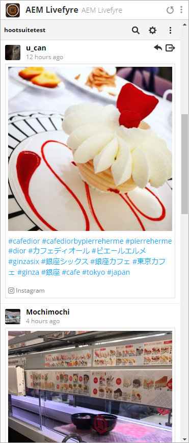
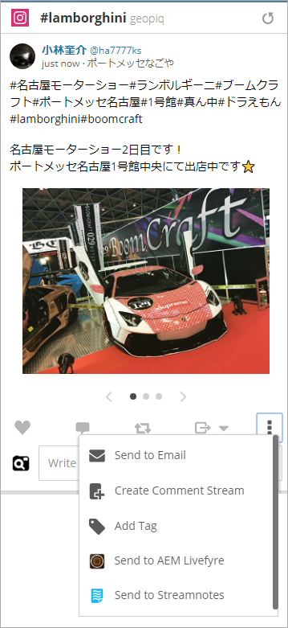
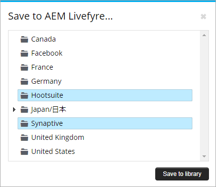
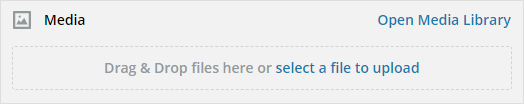
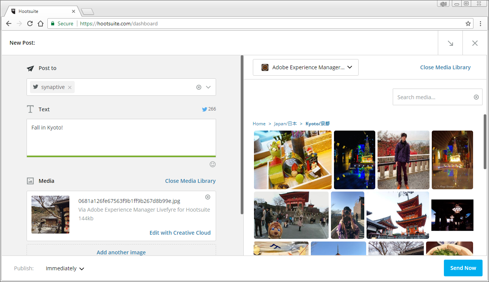

# Utilisation d’Adobe Experience Manager Livefyre avec Hootsuite{#use-adobe-experience-manager-livefyre-with-hootsuite}

Apprenez à utiliser Experience Manager Livefyre avec Hootsuite, ce qui vous permet de traiter, gérer et partager du contenu généré par l’utilisateur directement à partir du tableau de bord Hootsuite.

## Utilisation d’Adobe Experience Manager Livefyre avec Hootsuite {#topic_FB6E613DBCF74F39ABD5045C501EA326}

Apprenez à utiliser Experience Manager Livefyre avec Hootsuite, ce qui vous permet de traiter, gérer et partager du contenu généré par l’utilisateur directement à partir du tableau de bord Hootsuite.

## Prise en main {#task_22699BD901C24384AB2DC02D926D8F4A}

Contexte de la tâche

1. Installez Adobe Experience Manager Livefyre for Hootsuite à partir du répertoire des applications Hootsuite.

1. Dans votre tableau de bord Hootsuite, cliquez sur **Connexion avec Adobe**.

   

1. Connectez-vous à Experience Manager Livefyre à l’aide de vos identifiants Livefyre.
1. Cliquez sur **Autoriser** pour autoriser Hootsuite à accéder à vos bibliothèques.

   

   Une fois l’autorisation accordée, vous serez ramené au tableau de bord Hootsuite, où vous pourrez rechercher des fichiers dans vos bibliothèques Livefyre Experience Manager.

## Recherche de ressources {#task_0B011B0C539E400BB72A6DF69FBF66C0}

Contexte de la tâche

1. Cliquez sur l’icône de recherche dans la barre de menus pour rechercher des fichiers dans vos bibliothèques Livefyre Experience Manager.

   

1. Cliquez sur **Sélectionner** et une fenêtre contextuelle s’affiche avec toutes vos bibliothèques.
1. Cliquez sur le dossier d’une bibliothèque, puis sur **Sélectionner un dossier** pour sélectionner la bibliothèque qui sera affichée dans votre flux Hootsuite.

   

## Options de filtrage {#concept_5D062A9CD61A4B2E90784E5AA31CB16D}

Vous pouvez filtrer les résultats de votre recherche à l’aide des sections Afficher les ressources de, Droits, Mots-clés et Balises.

Les options de filtrage sont les suivantes :

| Section | Description |
|--- |--- |
| Afficher les ressources à partir de | Sélectionnez cette option pour afficher les fichiers de toutes les sources ou d’une source individuelle. Par exemple : Instagram, Twitter, Facebook, etc. |
| Droits | Sélectionnez cette option pour afficher uniquement les fichiers dont le paramètre de droits est spécifique. |
| Mots-clés | Sélectionnez cette option pour filtrer les résultats par mots-clés ou balises. Le filtrage par mots-clés recherche le contenu textuel d’une publication, ainsi que le nom d’affichage et le nom d’utilisateur de l’auteur. |
| Balises | Sélectionnez cette option pour filtrer les résultats par mots-clés ou balises. Le filtrage par mots-clés recherche le contenu textuel d’une publication, ainsi que le nom d’affichage et le nom d’utilisateur de l’auteur. |

Une fois que vous avez sélectionné les paramètres de recherche, vos fichiers s’affichent en flux continu lorsque vous effectuez une recherche :

### Options du menu de diffusion

Un clic sur le nom ou l’icône de l’utilisateur permet d’afficher l’utilisateur sur le réseau correspondant. Cliquez sur l’heure pour afficher l’article d’origine. Lorsque votre souris survole l’élément, d’autres options s’affichent. Cliquez sur le bouton Partager 

ajoute la ressource actuelle à la zone de composition réseau, ce qui vous permet de la partager avec vos réseaux via Hootsuite.

>[!NOTE]
>
>Le bouton Partager s’affiche uniquement lorsque vous filtrez des fichiers pour lesquels des droits ont été accordés.

Cliquez sur l’icône Attribuer  pour affecter l’élément actif à l’un des membres de votre équipe Hootsuite. Si un élément a déjà été affecté, la boîte de dialogue Résoudre 

apparaît. Cliquez dessus pour résoudre l’affectation actuelle.

### Autres menus d’application

Cliquez sur Paramètres. 

vous permettra de déconnecter le compte Livefyre d’Experience Manager actuel et de vous connecter à un autre compte.

Cliquez sur le menu 

affiche les liens pour ce document, le support et le site Web de Synaptive.

## Experience Manager Livefyre App Plugin {#task_33C8CEF4F5E44830B970BB3A7AAA2AA6}

Outre la possibilité d’afficher vos bibliothèques de fichiers dans un flux Hootsuite, vous pouvez également enregistrer des éléments des flux Instagram, Twitter, Facebook et YouTube dans vos bibliothèques Livefyre Experience Manager.

1. Cliquez sur l'icône de menu située au bas de chaque élément.

   

1. Sélectionnez **Envoyer vers AEM Livefyre**.
1. Sélectionnez une ou plusieurs bibliothèques dans lesquelles enregistrer le fichier.

   

1. Cliquez sur **Enregistrer dans la bibliothèque** et l’élément sera enregistré dans les bibliothèques que vous avez sélectionnées.

## Composant de la bibliothèque de supports Experience Manager Livefyre {#task_9CA2D5D49F8E463F9EF475BC09C8ACC9}

Vous pouvez accéder à vos fichiers via les composants média du compositeur de suite d’images.

1. Dans le compositeur, cliquez sur le lien **Ouvrir la bibliothèque** de supports dans la section **Média** .

   

1. Sélectionnez Adobe Experience Manager Livefyre dans le menu déroulant et vos fichiers s’afficheront.

   

1. Pour ajouter un fichier à la publication en cours, cliquez dessus. Pour rechercher une ressource spécifique, saisissez les termes de recherche dans la zone Média **de** recherche et les résultats s’affichent.
