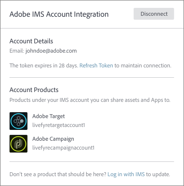
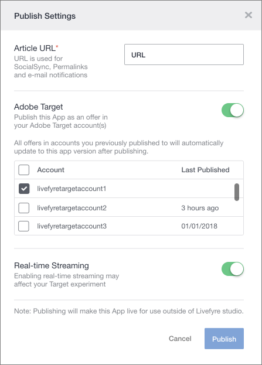

# Utilisation d’Adobe Experience Manager Livefyre avec Adobe Cible {#livefyre-target}

L’intégration de Livefyre à Adobe Cible vous permet de partager directement les applications Livefyre dans votre bibliothèque d’Offres de Cibles.

## Connexion d’une instance Livefyre à une Cible {#connect-livefyre-target}

Connectez une instance Livefyre à Adobe Cible en liant votre compte Adobe IMS dans les paramètres utilisateur.

1. Dans Livefyre Studio, cliquez sur l’ **[!UICONTROL Users]** onglet .

1. Sélectionnez le compte utilisateur auquel vous souhaitez vous connecter via l’intégration de compte IMS.

1. Cliquez sur **[!UICONTROL Connect]**.

1. Saisissez vos informations d’identification IMS.

Les instances de produit de votre compte Adobe IMS peuvent s’afficher dans la fenêtre d’intégration d’Adobe IMS.

Votre instance Livefyre est maintenant connectée à Adobe Cible.

## Partage d’une application Livefyre avec Adobe Cible {#share-livefyre-target}

Partagez une application créée dans Livefyre Studio directement avec Adobe Cible.

1. Dans Livefyre Studio, cliquez sur l’ **[!UICONTROL Apps]** onglet .

1. Sélectionnez l’application que vous souhaitez partager dans Adobe Cible.

1. Cliquez sur **[!UICONTROL Publish]**.

1. Dans les Paramètres de publication, cliquez sur le commutateur Adobe Cible.

Une liste d’instances de Cible s’affiche.

1. Sélectionnez l’instance de Cible dans laquelle vous souhaitez partager l’application.

1. Cliquez sur  **[!UICONTROL Publish]**.

L’application Livefyre peut désormais être utilisée dans votre bibliothèque d’Offres de Cible. Pour plus d’informations sur la publication d’applications, voir [Publier du contenu](/help/using/c-library/t-publish-content.md) et des [Offres](https://docs.adobe.com/content/help/en/target/using/experiences/offers/manage-content.html) dans la documentation de la Cible.