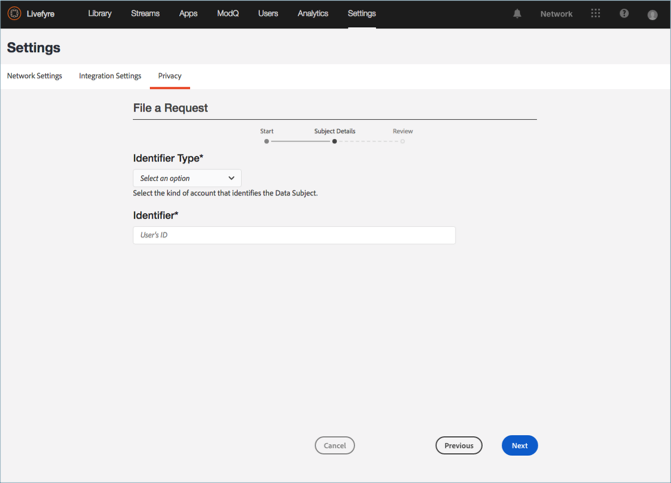

# Create a Privacy Request{#create-a-privacy-request}

Créez une demande de confidentialité dans Livefyre.

Supprimez toutes les données d’un utilisateur, générez un rapport de toutes les données d’un utilisateur et apportez les modifications d’inclusion ou d’exclusion à l’aide de ce processus.

Pour rechercher et rechercher un utilisateur et générer un rapport sur son contenu :

1. Accédez à **[!UICONTROL Settings > Privacy]**, puis cliquez sur **[!UICONTROL Create Request]**.

   

1. Renseignez les informations dans la **[!UICONTROL Submit Request]** fenêtre :

   * **[!UICONTROL Reference Id]**. Entrez un identifiant à utiliser pour une référence ultérieure. Par exemple, vous pouvez ajouter du texte, un numéro de ticket, une URL, une adresse électronique ou une autre chaîne de 255 caractères maximum.
   * **[!UICONTROL Type]**

      * **Accès**. Collecte toutes les données disponibles associées au compte. Les détails sensibles, tels que les mots de passe ou les informations d’identification sociales, seront masqués ou omis.

      * **Supprimer**. Crée ou obscurcit toutes les données associées au compte. **Si vous sélectionnez cette option et cliquez sur Envoyer, vous ne pouvez pas annuler ou annuler cette action,*ni récupérer les données supprimées.*** Si le compte appartient à un utilisateur de Livefyre Studio, certaines données seront conservées afin de préserver l’intégrité de vos enregistrements professionnels.

         >[!IMPORTANT]
         >
         >La suppression des données d’un compte entraîne la suppression définitive ou la destruction des données associées au compte. Vous ne pouvez pas inverser cette action, ni récupérer les données après leur suppression.

      * **Exclusion**. Empêche Livefyre de collecter passivement des données ou du contenu d’un compte social par le biais de flux ou de recherches sur les réseaux sociaux. L’inclusion et l’exclusion ne s’appliquent pas aux utilisateurs enregistrés.
      * **Inscription**. Permet de nouveau à Livefyre de collecter passivement des données ou du contenu à partir d’un compte social qui avait précédemment fait l’objet d’une exclusion via les flux ou la recherche sociale. L’inclusion et l’exclusion ne s’appliquent pas aux utilisateurs enregistrés.
      

   * **[!UICONTROL Identifier Type]** et **[!UICONTROL Identifier]**

      * **[!UICONTROL User Account]**

         * Identifie un compte d’utilisateur enregistré par l’ID de compte d’utilisateur généré par votre système de gestion des utilisateurs ou l’identifiant utilisateur Studio de Livefyre. Vous pouvez également localiser l’ID de compte d’utilisateur dans les détails de l’utilisateur dans les paramètres **** utilisateur de **Livefyre** ou dans les détails du contenu de la bibliothèque **de** fichiers ou du contenu de l’ **application.**

         * Valeurs autorisées : Chaîne alphanumérique pouvant contenir jusqu’à 255 caractères. Une adresse électronique n’est pas une entrée valide
      * **[!UICONTROL Facebook User]**

         * Identifie un compte à l’aide d’un ID numérique fourni par Facebook. Le demandeur doit fournir ceci. Vous trouverez des instructions sur la localisation de l’ID Facebook numérique [ici](https://www.facebook.com/help/1397933243846983?helpref=faq_content)
         * Valeurs autorisées : 6 à 16 caractères numériques
      * **[!UICONTROL Instagram User]**

         * Identifie le compte à l’aide d’un ID numérique fourni par Instagram. Le demandeur doit fournir ceci. Vous trouverez des instructions sur la localisation de l’ID Instagram numérique sur un compte Instagram en effectuant une recherche en ligne.
         * Valeurs autorisées : 5 à 16 caractères numériques
      * **[!UICONTROL Twitter User]**

         * Identifie un compte à l’aide d’un ID numérique fourni par Twitter. La personne qui demande la modification de la vie privée doit fournir cette information. Vous trouverez des instructions sur la manière de localiser l’ID Twitter numérique d’un compte Twitter en effectuant une recherche en ligne.
         * Valeurs autorisées : 5 à 16 caractères numériques
      * **[!UICONTROL YouTube User]**

         * Identifie un compte à l’aide d’un ID numérique fourni par YouTube. La personne qui demande la modification de la vie privée doit fournir cette information. Vous trouverez des instructions sur la localisation de l’ID YouTube numérique sur un compte YouTube [ici](https://support.google.com/youtube/answer/3250431?hl=en)
         * Valeurs autorisées : 5 à 16 caractères numériques
      * **[!UICONTROL Generic Author]**

         * Identifie un compte à l’aide d’un ID d’auteur Livefyre (JID). Utilisez cette option pour le contenu issu du RSS, de Tumblr ou des URL. Pour rechercher cet ID, recherchez le contenu attribué à l’auteur dans Contenu **** appli ou Bibliothèque **de** fichiers, puis sélectionnez un élément. L’ID est disponible dans Contenu **de l’** application sous **Infos** ou dans la bibliothèque **de** fichiers sous **Auteur dans la section Détails******

         * Valeurs autorisées : Chaîne alphanumérique pouvant contenir jusqu’à 255 caractères
         

1. Cliquez sur **[!UICONTROL Finish]**.

   

1. (Pour les requêtes Supprimer uniquement) Confirmez que vous souhaitez supprimer toutes les informations de l’utilisateur.

   >[!IMPORTANT]
   >
   >La suppression des données d’un compte entraîne la suppression définitive ou la destruction des données associées au compte. Vous ne pouvez pas inverser cette action, ni récupérer les données après leur suppression.

