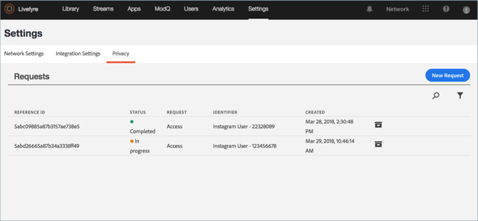

# Vue d’un rapport de confidentialité{#view-a-privacy-report}

Vue d’un rapport de confidentialité dans Livefyre pour voir quelles informations sont enregistrées dans Livefyre pour un utilisateur.

1. Atteindre **[!UICONTROL Settings > Privacy]**.
1. Cliquez sur un rapport de confidentialité de la liste à la vue.

