# Localiser les chaînes {#localize-strings}

Personnalisation des chaînes des applications Livefyre.

Les chaînes de texte de la plupart des éléments HTML de toute application Livefyre peuvent être personnalisées. Cela offre la possibilité de modifier le texte des éléments HTML rendus, tels que le bouton &quot;Publier sous&quot;, le texte &quot;Compte de commentaires&quot; ou le bouton &quot;Se connecter&quot;, en toute chaîne UTF-8 valide. Utilisez cette fonction pour ajouter de la personnalité à votre mise en oeuvre du flux ou pour localiser la langue dans l’application pour votre base d’utilisateurs.

* Commentaires, conversation et blog en direct

   * [Mise en œuvre](#c-localize-strings/section_im4_224_xz)
   * [Accès au compte](#c-localize-strings/section_cm3_d24_xz)
   * [Informations sur le flux](#c-localize-strings/section_wx1_c24_xz)
   * [Tri en continu](#c-localize-strings/section_ih2_124_xz)
   * [Infos sur le contenu](#c-localize-strings/section_llv_yd4_xz)
   * [Contenu proposé](#c-localize-strings/section_gmw_vd4_xz)
   * [Editeur de texte](#c-localize-strings/section_ky5_td4_xz)
   * [Options de réponse](#c-localize-strings/section_zvt_qd4_xz)
   * [Notificateur de commentaires](#c-localize-strings/section_qqt_pd4_xz)
   * [Messages d’erreur](#c-localize-strings/section_omz_jxn_xz)

* [Format d’heure et de date](#c-localize-strings/section_yz4_g5n_xz)
* [Mur multimédia](#c-localize-strings/section_vwt_d5n_xz)
* [Carte](#c-localize-strings/section_fxv_c5n_xz)
* [Mosaïque](#c-localize-strings/section_e2s_b5n_xz)
* [Carrousel](#c-localize-strings/section_l2z_hkn_xz)
* [Carte des fonctionnalités](#c-localize-strings/section_mw2_hkn_xz)
* [Sondage](#c-localize-strings/section_pdg_fwh_xz)
* [Identité Livefyre](#c-localize-strings/section_zc3_xvh_xz)
* Plus:
   * [Vérifier les chaînes de texte](/help/using/c-settings-other/c-translation-sets/c-review-text-strings.md#c_review_text_strings)
   * [Sidenotes](/help/using/c-settings-other/c-translation-sets/c-sidenotes-text-strings.md#c_sidenotes_text_strings)

## Implémentation {#section_im4_224_xz}

Pour mettre en oeuvre cette fonctionnalité, transmettez un mappage d’objet 1-1 des chaînes que vous souhaitez remplacer à l’objet de configuration JavaScript. Si vous ne fournissez pas de champ, le texte par défaut est utilisé.

Exemple :

```
var customStrings = {     
   postAsButton: "New Post As Text",     
   postEditButton: "New Post Edit Text"  
};   
   convConfig["strings"] = customStrings; fyre.conv.load(     
   networkConfig,     
   [convConfig],     
   function(){}  
);
```

Cette page liste toutes les chaînes de texte qui peuvent être personnalisées pour les applications principales Livefyre.

## Accès au compte {#section_cm3_d24_xz}

Chaînes disponibles pour le processus d’authentification et à partir des menus des utilisateurs authentifiés.

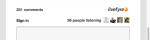

| Élément | Clé | Texte par défaut |
|---|---|---|
|  | displayName | %s |
|  | editProfile | Modifier le profil |
|  | notificationSettings | Paramètres de notification |
|  | siteAdmin | Admin Console (liens vers Studio) |
|  | signOut | Se déconnecter |

## Informations sur le flux {#section_wx1_c24_xz}

Chaînes disponibles pour l’affichage et les informations du flux de contenu. Liste le nombre de personnes qui écoutent, le nombre de publications sur l’application et permet aux utilisateurs de se connecter ou d’accéder aux informations de leur compte.

| Clé | Texte par défaut | Données de diffusion en continu |
|---|---|---|
|  | commentCountLabelZero | Commentaire %s |
|  | commentCountLabel | Commentaire %s |
|  | commentCountLabelPlural | %s commentaires |
|  | listenerCount | écoute de personne |
|  | listenerCountPlural | écoute |
|  | liveblogPostCountLabelZero | publier |
|  | liveblogPostCountLabel | publier |
|  | liveblogPostCountLabelPlural | publications |
| Options de thread | threadBreakoutButton | Afficher le thread entier |
|  | toggleCollapse | Basculer vers la réduction |
| Vitesse élevée/commentaires en file d’attente | actualiser | Actualiser |
|  | newComment | Nouveau commentaire |
|  | newComments | Nouveaux commentaires |
|  | newReply | nouvelle réponse |
|  | newRéponses | nouvelles réponses |

## Tri de flux {#section_ih2_124_xz}

Permet aux utilisateurs de trier le contenu renvoyé par âge ou par popularité.

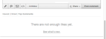

| Clé | Texte par défaut | Options d’en-tête |
|---|---|---|
|  | sortNewest | Plus récent |
|  | sortOldest | Plus ancien |
|  | sortTopComments | Principaux commentaires |
|  | sortHotThreads | Threads chauds |
|  | sortSeparator |  |  |
|  | streamSorting | Chargement en cours |
|  | topCommentsContentNotFoundMsg | Il n&#39;y a pas encore assez de &quot;j&#39;aime&quot;. |
|  | hotThreadsContentNotFoundMsg | Il n&#39;y a pas encore assez de threads. |
|  | streamRefreshMsg | Découvrez les nouveautés. |
| Options de pied de page | archiveHeaderTitle | Depuis l&#39;archive |
|  | archiveShowMore | Afficher plus |
|  | showMore | Afficher plus de commentaires |
|  | showMoreLiveblog | Afficher plus de publications |

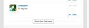

## Informations sur le contenu {#section_llv_yd4_xz}

Listes publient des informations : nom d’utilisateur, toute balise d’utilisateur appliquée et heure de publication.

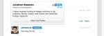  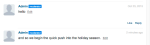

| Clé | Texte par défaut | Auteur |
|---|---|---|
|  | modérateur | modérateur |
|  | hovercardViewProfile | Profil vue complet |
| Informations sur la publication | timeJustNow | maintenant |
|  | timeMinutesAgo | il y a une minute |
|  | timeMinutesAgoPlural | il y a plusieurs minutes |
|  | timeHoursAgo | heure il y a |
|  | timeHoursAgoPlural | il y a plusieurs heures |
|  | timeDaysAgo | day ago |
|  | timeDaysAgoPlural | jours plus tôt |
|  | aimePlural | Mentions J’aime |
|  | LikeSingular | J’aime |
|  | modérateurModifierHorodatage | Modifié par un modérateur |
|  | commentTombstone | Ce commentaire a été supprimé. |
|  | permalinkNotFoundMsg | Ce commentaire n’est plus visible. |
|  | quickProfileTooltip | Profil rapide |

## Contenu proposé {#section_gmw_vd4_xz}

S’il est activé, le contenu phare est répertorié en haut du flux.

|  | Clé | Texte par défaut |
|---|---|---|
| Libellés présentés |  |  |
| 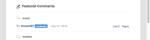 | featuredCommentsTag | En vedette |
|  | featuredCommentsTitlePlural | Commentaires présentés |

## Éditeur de texte {#section_ky5_td4_xz}

Par défaut, disponible en haut de la page pour tous les utilisateurs.

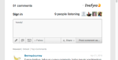

|  | Clé | Texte par défaut |
|---|---|---| 
| Boutons de l’éditeur | follow | + S’abonner |
|  | désabonner | - Ne pas suivre |
|  | liveblogFollow | Suivez le blog en direct |
|  | liveblogUnfollow | Annuler le suivi du blog en direct |
|  | postButton(Disponible pour les utilisateurs connectés.) | Commentaire de publication |
|  | postAsButton (Disponible pour les utilisateurs non authentifiés) | Publier le commentaire sous... |
|  | postEditButton | Modifier le commentaire |
|  | postEditAsButton | Modifier le commentaire comme... |
|  | postEditCancelButton | Annuler |
|  | editorDisabled | Cette conversation est actuellement fermée aux nouveaux commentaires. |
| Options de conversation | livechatPostButtonLabel | Publication |
|  | livechatPostEditButton | Modifier      |
|  | livechatWindowsInstruction | Appuyez sur Ctrl+Entrée pour publier |
|  | livechatOtherInstruction | Appuyez sur la commande+Entrée pour publier |

## Options de réponse {#section_zvt_qd4_xz}

Sauf indication contraire, cette option est accessible à tous les utilisateurs connectés. Placez le pointeur de la souris sur un panneau de contenu pour y accéder.

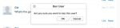

| Clé | Texte par défaut |  |
|---|---|---|
| Options de réponse utilisateur | Disponible pour les utilisateurs finaux. |  |
| flagButton | Marquer d’un indicateur |
|  | flagCommentTooltip | Marquer d’un indicateur |
|  | editButton (Disponible uniquement pour les auteurs et les modérateurs, s’il est activé) | Modifier      |
|  | deleteButton (Disponible uniquement pour les auteurs et les modérateurs, s’il est activé) | Supprimer |
|  | deleteCommentTooltip | Supprimer |
|  | shareButton | Partager |
|  | shareCommentTooltip | Partager |
|  | likeButton | J’aime |
|  | contrairementButton | Je n’aime pas |
|  | responseButton | Répondre |
|  | responseButtonSingular (Disponible pour la discussion et le blog en direct). | Répondre |
|  | responseButtonPlural(Disponible pour la discussion et le blog en direct). | Réponses |

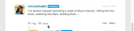

| Clé | Texte par défaut |  |
|---|---|---|
| Indicateur modal | flagTitle | Marquer le commentaire de %s |
|  | flagSubtitle | Marquer comme |
|  | flagDefaultSelectOption | Sélectionner |
|  | flagSpam | Indésirables |
|  | flagSpamButton | Indésirables |
|  | flagSpamCommentTooltip | Indésirables |
|  | flagOffensive | Offensive |
|  | flagOffensiveButton | Offensive |
|  | flagOffensiveCommentTooltip | Offensive |
|  | flagDésaccord | Désaccord |
|  | flagDisacceptButton | Désaccord |
|  | flagDisacceptCommentTooltip | Désaccord |
|  | flagOffTopic | Désactivé la rubrique |
|  | flagOfftopicButton | Désactivé la rubrique |
|  | flagOfftopicCommentTooltip | Désactivé la rubrique |
|  | flagEmail | Courrier électronique |
|  | flagEmailPlaceholder | you@example.com |
|  | flagNotes | Remarques |
|  | flagNotesPlaceholder | Début de saisie ici... |
|  | flagConfirmButton | OK |
|  | flagCancelButton | Annuler |
|  | flagConfirmationMessage | Marquer le commentaire de %s comme %s ? |
|  | flagSuccessMsg | Le commentaire a été marqué. |

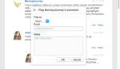

| Clé | Texte par défaut |  |
|---|---|---|
| Partager modal | shareTitle | Partager le commentaire |
|  | sharePlaceholderText | Que penses-tu ? |
|  | shareLabel | Partager sur : |
|  | shareTextTwitter | vide |
|  | shareTextFacebook | vide |
|  | shareTextLinkedin | vide |
|  | shareButtonText | Partager |
|  | sharePermalink | Permalink |
|  | loadingPermalink | Chargement de l&#39;URL courte... |
|  | shareText | Je viens de publier un commentaire. Regardez ! |

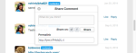

| Clé | Texte par défaut |  |
|---|---|---|
| Modèle de réponse | postReplyAsButton | Publier le commentaire sous... |
|  | postReplyButton (Disponible pour les utilisateurs connectés.) | Commentaire de publication |
|  | backToHotThreads | Retour à Threads chauds |

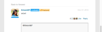

| Clé | Texte par défaut |  |
|---|---|---|
| Module de mention @mention twitter | mentionTitle | Partager la mention |
|  | mentionSous-titreTwitter | Partager le tweet à : |
|  | mentionsDefaultText | Je vous ai mentionné dans un commentaire sur Livefyre ! |
|  | mentionConfirmButton | OK |
|  | mentionAnnulerBouton | Annuler |
|  | mentionsErrorGeneral | Oups ! Quelque chose s&#39;est mal passé ! Livefyre a été alerté. |
|  | mentionErrorNoneSelected | Au moins une mention doit être activée. |
|  | mentionTitreMenu | Pour voir et mentionner vos amis |
|  | mentionsTwitterConnect | Connexion à Twitter |
|  | mentionTwitterRécupération | Récupération des amis... |
|  | mentionsSuccessMsg | Les mentions ont bien été envoyées. |

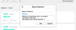

| Clé | Texte par défaut |  |
|---|---|---|
| Modifier le modèle | Disponible pour les administrateurs de Studio, les gestionnaires d’utilisateurs ou les modérateurs |  |
| @(@mentions) | &lt;/>(Ouvre la fenêtre html personnalisée.) |  |
|  | customHtmlDialogTitle(Apparaît comme en-tête pour le modal.) | Ajouter HTML personnalisé |

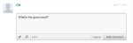

| Clé | Texte par défaut |  |
|---|---|---|
| Options de réponse du modérateur | Disponible pour les administrateurs Studio, les gestionnaires d’utilisateurs ou les modérateurs. |  |
| waitComment | pending (en attente) |
|  | banUserButton | Interdire l&#39;utilisateur |
|  | banUserTooltip | Interdire l&#39;utilisateur |
|  | bozoButton | Bozo |
|  | bozoCommentTooltip | Bozo |
|  | featureButton | Fonctionnalité |
|  | featureCommentTooltip | Fonctionnalité |
|  | unfeatureButton | Annuler |
|  | featuredCommentTooltip | Annuler |

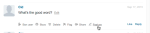

| Clé | Texte par défaut |  |
|---|---|---|
| Interdire le mode d&#39;utilisation | Disponible pour les administrateurs Studio, les gestionnaires d’utilisateurs ou les modérateurs. |  |
| banTitle | Interdire l&#39;utilisateur |  |
|  | banConfirmation | Êtes-vous sûr de vouloir interdire cet utilisateur ? |
|  | banConfirmButton | OK |
|  | banCancelButton | Annuler |

## Notificateur de commentaires {#section_qqt_pd4_xz}

Si cette option est activée, elle est disponible en bas de la page pour toutes les applications de conversation Livefyre.

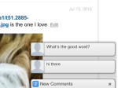

|  | Clé | Texte par défaut |
|---|---|---|
| Libellés de notification | commentNotifier | Nouveau commentaire |
|  | commentNotifierPlural | Nouveaux commentaires |
|  | liveblogNotifier | Nouvelle publication |
|  | liveblogNotifierPlural | Nouvelles publications |

## Messages d’erreur {#section_omz_jxn_xz}

Chaînes disponibles pour les messages d’erreur personnalisables.

| Clé | Texte par défaut |
|---|---|
| errorAuthError | Vous n’êtes pas autorisé à publier un commentaire sur cette conversation. |
| errorCommentsNotAllowed | Les commentaires ne sont pas autorisés sur cette conversation |
| errorDefault | Une erreur s&#39;est produite. Veuillez réessayer. |
| errorDuplicate | Autant que vous aimiez votre commentaire, vous n’êtes pas autorisé à le publier deux fois. |
| errorEditDuplicate | Vous devez modifier le corps du commentaire lorsque vous le modifiez. |
| errorEditNotAllowed | Vous n’êtes pas autorisé à modifier des commentaires sur cette conversation. |
| errorEditTimeExceeded | Votre période de modification des commentaires a expiré. |
| errorEmpty | Il semble que vous essayez de publier un commentaire vide. |
| errorExpired | Votre session a expiré. Veuillez recharger la page. |
| errorFlagNotSelected | Veuillez sélectionner un type d&#39;indicateur. |
| errorGuestLiked | Désolé, seuls ceux qui ont des comptes peuvent aimer le contenu. |
| errorInsuffisantePermissions | Autorisations insuffisantes |
| errorInvalidChar | Il semble que vous essayez de publier un caractère non valide. |
| errorLikeOwnComment | Vous ne pouvez pas aimer votre propre commentaire |
| errorMalformed | Il semble que vous essayez de publier du contenu mal formé. |
| errorMaxChars | Désolé, votre commentaire est trop long. Veuillez modifier et réessayer. |
| errorMediaNotAvailable | Les médias ne sont plus visibles. |
| errorShowMore | Une erreur s&#39;est produite lors du chargement d&#39;autres commentaires. |
| ErreurMultimédiaNonAutoriséMultimédia | Vos autorisations ne vous accordent qu’une seule pièce jointe multimédia à la fois. |

## Format d’heure et de date {#section_yz4_g5n_xz}

Traduisez et personnalisez l’aspect des dates sur les cartes de contenu dans les applications de visualisation.

| Clé | Texte par défaut |
|---|---|
| heuresAgo | {number}h |
| hoursAgoSingular | {number}h |
| justNow | 1 |
| minutesAgo | {number}m |
| minutesAgoSingular | {number}m |
| monthDayFormat | {day} {monthAbbrev} |
| monthDayYearFormat | {day} {monthAbbrev} {year} |
| monthNames | janvier, février, mars, avril, mai, juin, juillet, août, septembre, octobre, novembre, décembre |
| monthNamesAbbrev | Jan, Feb, Mar, Apr, May, Jun, Jul, Aug, Sep, Oct, Nov, Dec |
| secondsAgo | {number}s |
| secondsAgoSingular | {number}s |

## Mur de médias {#section_vwt_d5n_xz}

Chaînes disponibles pour l’application Media Wall App.

| Clé | Texte par défaut |
|---|---|
| featuredText | En vedette |
| shareButtonText | Partager |

| Clé | Texte par défaut |
|---|---|
| postButtonText | Que pensez-vous ? |
| postModalTitle | Publier votre commentaire |
| postModalButton | Publier votre commentaire |
| postModalPlaceholder | Que voudriez-vous dire ? |
| showMoreButtonText | Charger plus |
| shareButtonText | Partager |

## Carte {#section_fxv_c5n_xz}

Chaînes disponibles pour les zones cliquables.

| Clé | Texte par défaut |
|---|---|
| featuredText | En vedette |
| shareButtonText | Partager |

## Mosaïque {#section_e2s_b5n_xz}

Chaînes disponibles pour les mosaïques.

| Clé | Texte par défaut |
|---|---|
| featuredText | En vedette |
| shareButtonText | Partager |

## Carrousel {#section_l2z_hkn_xz}

Chaînes disponibles pour le carrousel.

| Clé | Texte par défaut |
|---|---|
| featuredText | En vedette |
| shareButtonText | Partager |

## Feature Card {#section_mw2_hkn_xz}

Chaînes disponibles pour la carte de fonction.

| Clé | Texte par défaut |
|---|---|
| featuredText | En vedette |
| shareButtonText | Partager |

## Télécharger l’application {#section_grc_gkn_xz}

Chaînes disponibles pour l’application de téléchargement.

| Clé | Texte par défaut |
|---|---|
| postButtonText | Que pensez-vous ? |
| postModalTitle | Publier votre commentaire |
| postModalButton | Publier votre commentaire |
| postModalTitlePlaceholder | Entrez un titre |
| postModalPlaceholder | Que voudriez-vous dire ? |
| postModalConfirationTitle | Merci d&#39;avoir publié ! |
| postModalConfirmationMessage | Votre publication est en cours de révision. |
| postModalConfirmationButton | Terminé |
| title |  |
| message |  |
| editorErrorAttachmentsRequired | Une pièce jointe est requise |
| editorErrorBody | Veuillez ajouter un message |
| editorErrorDuplicate | Autant que vous aimez votre note, vous ne pouvez pas la publier deux fois. |
| editorErrorGeneric | Une erreur s’est produite |
| editorErrorTitleRequired | Un titre est requis |

## Sondage {#section_pdg_fwh_xz}

Chaînes disponibles pour les sondages.

| Clé | Texte par défaut |
|---|---|
| totalVotesLabel | %s votes totaux |
| shareStringText | Je viens de voter sur %s quel est votre vote ? |
| pollClosedLabel | Ce sondage est actuellement fermé |

## Identité Livefyre {#section_zc3_xvh_xz}

Chaînes disponibles pour l’identité Livefyre.

| Clé | Texte par défaut |
|--- |--- |
| automatiquementFollowConversations | Suivre automatiquement les conversations auxquelles je participe |
| back | Retour |
| bio | Biographie |
| créer | Créez     |
| createANewAccount | Créer un nouveau compte |
| createNewAccountWithEmail | Créer un nouveau compte par courrier électronique |
| changeAvatar | Modifier l’avatar |
| choiceFile | Choisir un fichier |
| completeAccount | Compte complet |
| emailWhenSomeoneRéponlies | Envoyer un courriel lorsque quelqu&#39;un me répond |
| emailCommentsIFollow | Envoyer les commentaires par courriel dans les conversations que je suis |
| emailSenttoResetPassword | E-mail envoyé ! Recherchez dans votre boîte de réception un lien permettant de réinitialiser votre mot de passe. |
| emailVerificationSent | Vérification par courrier électronique envoyée |
| firstName | Prénom |
| oubliéPassword | Mot de passe oublié ? |
| oubliéVotreMot de passe | Vous avez oublié votre mot de passe ? |
| oubliéYourPasswordInstructions | Entrez votre nom d&#39;utilisateur ou votre adresse électronique ci-dessous et nous vous enverrons un lien pour modifier votre mot de passe. |
| formInputCloseButtonText | Fermer |
| formInputCancelButtonText | Annuler |
| formInputSaveButtonText | Enregistrer |
| hasNotLeftAnyComments | n’a laissé aucun commentaire |
| locationIsFrom | est de |
| labelAvatar | Avatar |
| labelComments | Commentaires |
| labelConfirmNewPassword | Confirmer le nouveau mot de passe |
| labelConfirmPassword | Confirmer le mot de passe |
| labelEmail | Email Address |
| labelLikes | Mentions J’aime |
| labelLoading | Chargement en cours |
| labelNewPassword | Nouveau mot de passe |
| labelNotification | Notifications |
| labelPassword | Mot de passe |
| labelProfile | Profil |
| labelUsername | Nom d’utilisateur |
| labelUsernameOrEmail | Nom d’utilisateur ou adresse électronique |
| lastName | Nom |
| livefyreAccount | Compte Livefyre |
| emplacement | Emplacement |
| loadingProfile | Profil de chargement |
| newPassword | Nouveau mot de passe |
| oldPassword | Ancien mot de passe |
| on | on |
| ou | ou |
| passwordLinkExpired | Le lien sur lequel vous avez cliqué pour réinitialiser votre mot de passe a expiré. Réinitialisez votre mot de passe et nous vous enverrons un nouveau lien. |
| plaisecheckEmailToComplete | Veuillez vérifier votre adresse électronique pour compléter votre inscription. |
| publié | Publié |
| powerBy | alimenté par |
| profileNotificationImmédiat | immediate |
| profileNotificationHourly | horaires |
| profileNotificationNever | never |
| récentsCommentaires | Commentaires récents |
| réinitialiser | Reset |
| resetPassword | Réinitialiser le mot de passe |
| signIn | Se connecter |
| signInWith | Se connecter avec |
| signInWithEmail | Se connecter avec un courrier électronique |
| signUp | abonnement |
| socialAccount | Compte social |
| successPasswordChanged | Succès! Votre mot de passe a été modifié et vous êtes maintenant connecté. |
| termsAndConditions | Termes et conditions |
| termsAndConditionsIntro | En vous inscrivant, vous acceptez le |
| termsOfUse | Conditions d’utilisation |
| termsOfUseIntro | En vous connectant, vous acceptez de |
| thisUser | Cet utilisateur |
| verifyPassword | Vérifier le mot de passe |
| fileSizeLimit | 2 Mo max |
| accountnotfound | Compte introuvable |
| avatarImageExceedSize | Votre image d&#39;avatar a dépassé la limite de 2 Mo de fichier |
| fieldisrequired | Le champ accepte uniquement un entier. |
| fieldonlyacceptsavalidemail | Le champ accepte uniquement un courrier électronique valide |
| fieldonlyacceptletter | Le champ accepte uniquement les lettres |
| filesizemustbelessthanMB | La taille du fichier doit être inférieure à {#}Mo |
| invalidusernameorpassword | Nom d&#39;utilisateur ou mot de passe non valide |
| minimumlengthos | Longueur minimale de {#} caractères |
| maximumlengthofcharacters | Longueur maximale de {#} caractères |
| therewasanerror | Une erreur s’est produite |
| ce champ non requis | Ce champ est obligatoire. |
| validfileextensions | Extensions de fichiers valides |
| valuemustmatch | La valeur doit correspondre |
| passwordLength | de 6 à 32 caractères. |
| passwordCharacters | comprennent des caractères minuscules et majuscules. |
| passwordSymbols | inclure au moins un nombre et un symbole. |
| passwordUsername | ne contient pas votre nom d&#39;utilisateur. |
| passwordPopoverTitle | Votre mot de passe doit : |
| passwordErrorContainsFirstName | Le mot de passe que vous avez entré contient votre nom d&#39;utilisateur, votre prénom ou votre nom. Pour des raisons de sécurité, veuillez entrer un mot de passe qui ne contient pas votre nom d&#39;utilisateur, prénom ou nom. N&#39;oubliez pas non plus que votre mot de passe doit contenir : 6 à 32 caractères Caractère majuscule Caractère minuscule Symbole A |
| passwordErrorContainsLastName | Le mot de passe que vous avez entré contient votre nom d&#39;utilisateur, votre prénom ou votre nom. Pour des raisons de sécurité, veuillez entrer un mot de passe qui ne contient pas votre nom d&#39;utilisateur, prénom ou nom. N&#39;oubliez pas non plus que votre mot de passe doit contenir : 6 à 32 caractères Caractère majuscule Caractère minuscule Symbole A |
| passwordErrorContainsUsername | Le mot de passe que vous avez entré contient votre nom d&#39;utilisateur, votre prénom ou votre nom. Pour des raisons de sécurité, veuillez entrer un mot de passe qui ne contient pas votre nom d&#39;utilisateur, prénom ou nom. N&#39;oubliez pas non plus que votre mot de passe doit contenir : 6 à 32 caractères Caractère majuscule Caractère minuscule Symbole A |
| passwordErrorTooShort | 6 caractères minimum pour le mot de passe |
| passwordErrorTooLong | 32 caractères au maximum pour le mot de passe |
| passwordErrorMissingUppercase | Le mot de passe doit contenir au moins un caractère majuscule. |
| passwordErrorMissingLowercase | Le mot de passe doit contenir au moins un caractère minuscule. |
| passwordErrorMissingSymbol | Le mot de passe doit contenir au moins un symbole dans l&#39;ensemble `!@#$%^&*()?.,<>\’;:”[]{}|` |
