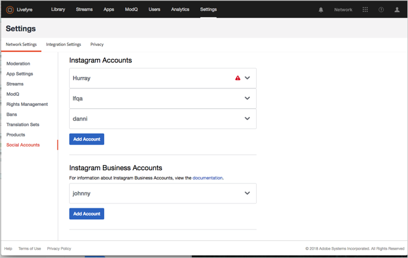
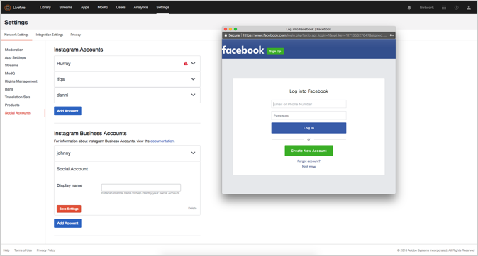

# Ajouter un compte Social{#add-a-social-account}

Configurez un compte social pour demander des droits ou rechercher l’UGC dans les flux ou les recherches sur les réseaux sociaux.

Livefyre utilise des comptes sociaux Twitter et Instagram pour vous permettre d’effectuer une recherche sociale (dans la bibliothèque) ou d’utiliser des flux.

Vous devez configurer un compte dans Twitter pour utiliser la recherche sociale Twitter dans la bibliothèque.

Instagram a différentes règles pour les comptes sociaux, en fonction de la manière dont vous utilisez l&#39;Adobe Livefyre. Pour plus d’informations sur le type de comptes sociaux que vous pouvez utiliser avec Livefyre, voir [A propos des comptes Instagram](/help/using/c-users-creating-accounts-with-studio-access/t-configure-social-accout-instagram/c-about-instagram-accounts.md#c_about_instagram_accounts).

Pour configurer un compte social :

1. Accédez à **[!UICONTROL Settings >]** **[!UICONTROL Network Settings.]**
1. Accédez à la section **[!UICONTROL Social Accounts]** sous **[!UICONTROL Network Settings]**.
1. Cliquez sur **[!UICONTROL Add Account]** sous le type de compte social que vous ajoutez. Une boîte de dialogue s’affiche pour vous permettre d’autoriser le compte pour Livefyre.

   

   >[!NOTE]
   >
   >Lorsque vous configurez un compte d&#39;entreprise Instagram, vous accédez à un écran de connexion Facebook. Continuez à vous connecter normalement.     >

1. Cliquez sur **[!UICONTROL Authorize App]** pour continuer.
1. Ajoutez un **[!UICONTROL Display Name]** pour le compte, puis cliquez sur **[!UICONTROL Save Settings.]**. Cliquez sur **[!UICONTROL Social Account]** dans l&#39;en-tête de la zone d&#39;informations du compte pour réduire le compte.
