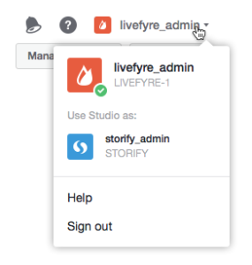

# Utilisateurs permutés{#users-switching-networks}

Vous pouvez gérer plusieurs réseaux à partir d'un seul compte Studio.

>[!NOTE]
>
>Ce n'est pas courant.

Le menu **[!UICONTROL Account]** déroulant répertorie tous les noms d'utilisateur associés au compte Studio auquel vous êtes actuellement connecté et les réseaux avec lesquels ils sont associés. Utilisez cette conversion pour sélectionner le réseau que vous souhaitez gérer.

>[!NOTE]
>
>Bien que la plupart des utilisateurs disposent d'autorisations pour un seul réseau, certains utilisateurs de Studio peuvent posséder ou modérer plusieurs sites. Le compte Studio permet de se connecter avec un seul nom d'utilisateur et un seul mot de passe, puis de basculer entre plusieurs niveaux d'accès au site.

