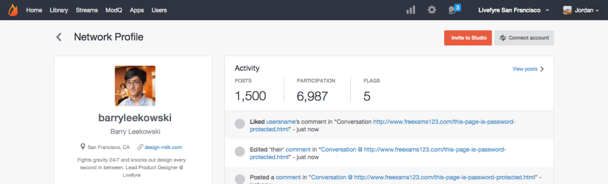

# Lier les comptes d’utilisateurs{#link-user-accounts}

Liez votre compte Studio à votre compte Livefyre pour modérer ou gérer tous vos sites ou réseaux Livefyre à partir d’un seul emplacement.

>[!NOTE]
>
>Pour interagir avec une application Livefyre (par exemple, laisser un commentaire, ajouter une Sidenote ou partager du contenu), vous devez vous connecter à l’aide de votre nom d’utilisateur et mot de passe de compte Livefyre, et non de votre nom d’utilisateur et mot de passe de compte Studio.

Pour lier des comptes :

1. Connectez-vous à Studio après avoir créé un profil utilisateur Livefyre sur votre réseau.
1. Accédez à **[!UICONTROL Users]**, recherchez votre Profil utilisateur, puis cliquez sur le doublon pour accéder aux détails de la vue.
1. Cliquez sur **[!UICONTROL Connect account]**.
1. Dans la fenêtre qui s’ouvre, sélectionnez le compte d’utilisateur à lier à ce compte.
1. Confirmez les informations **[!UICONTROL Link Profile]**, puis cliquez sur **[!UICONTROL Link]**. 

