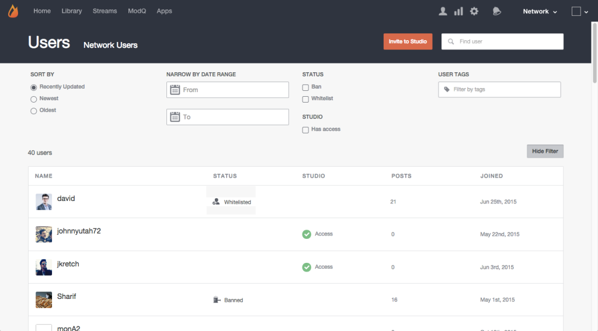

# Rechercher des utilisateurs{#search-for-users}

Utilisez le champ Rechercher situé en haut de la page pour rechercher les visiteurs du site par nom d'affichage, utilisateur - id, adresse électronique ou date de jonction de votre réseau Livefyre.

>[!NOTE]
>
>Ces champs prennent en charge la recherche de caractères génériques.

1. Cliquez pour **[!UICONTROL Show Filter]** ouvrir un panneau à partir duquel les utilisateurs répertoriés peuvent être filtrés.
1. **[!UICONTROL Sort by]** mises à jour des comptes utilisateur répertoriés : Récemment mis à jour, Plus récent ou Plus ancien.
1. **[!UICONTROL Narrow by Date Range]** pour répertorier uniquement les comptes d'utilisateurs ajoutés au cours de la période d'entrée.
1. Liste uniquement **[!UICONTROL Banned]** ou **[!UICONTROL Whitelisted]** utilisateurs.
1. Répertorier uniquement **[!UICONTROL Studio]** les utilisateurs.
1. Répertorier uniquement ces comptes avec la saisie **[!UICONTROL User Tags]** jointe. 

